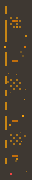
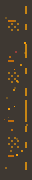
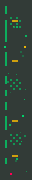
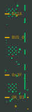

# 📦 PIXEL README KIT — ПОЛНЫЙ КАТАЛОГ КОМПОНЕНТОВ

<div id="top"></div>

<div align="center">


<br/><br/>

<a href="README.md"> <b>[ ⬅️ ВЕРНУТЬСЯ В ГЛАВНЫЙ README ]</b></a>
&nbsp;&nbsp;
<a href="#top"> <b>[ ▲ НАВЕРХ ]</b></a>

<br/><br/>

<!-- ANIMATED PCB DIVIDER -->


</div>

> **СПРАВОЧНИК АССЕТОВ**: Здесь представлены **все 100+ SVG-компонентов** дизайн-системы `Pixel Readme Kit v2.2`.  
> Каждый элемент снабжен визуальным превью, путем к файлу, габаритами и готовым кодом для вставки в Markdown.

---

## 📑 Оглавление каталога

1. [Заглавные шапки (Master Headers)](#1-заглавные-шапки-master-headers)
2. [Закрывающие пластины (Master Footers)](#2-закрывающие-пластины-master-footers)
3. [Инлайн-плашки и алерты (Inline Callouts & Alerts)](#3-инлайн-плашки-и-алерты-inline-callouts--alerts)
4. [Пиксельные маркеры списков (Pixel Bullet Lists 14×14)](#4-пиксельные-маркеры-списков-pixel-bullet-lists-1414)
5. [Голографические чипы и бейджи (Chips & Pills)](#5-голографические-чипы-и-бейджи-chips--pills)
6. [Рамки окон (Frames: Top & Bottom)](#6-рамки-окон-frames-top--bottom)
7. [Переходные адаптеры плеч (Transitional Shoulders 45°)](#7-переходные-адаптеры-плеч-transitional-shoulders-45)
8. [Боковые шины и рельсы (Rails & Gutters)](#8-боковые-шины-и-рельсы-rails--gutters)
9. [Разделители глав и сплиттеры (Dividers & Splitters)](#9-разделители-глав-и-сплиттеры-dividers--splitters)

---

<div id="1-заглавные-шапки-master-headers"></div>

## 1. 🏛️ Заглавные шапки (Master Headers)

Флагманские титульные баннеры для верхней части репозитория или профиля.

### 1.1 Cyberpunk 3D Workstation (Радар 360° + CRT Scanline + Эквалайзер)
- **Файл**: `assets/headers/header-terminal-cyberpunk.svg`
- **Размер**: `850×260` (адаптивный `100%`)
- **Особенности**: 3D-пиксельный шрифт, живой вращающийся луч радара, сканирующая полоса, эквалайзер, статус кластера.


```html

```

<br/>

### 1.2 Tactical Military HUD (Прицельный лазер + Скосы 45°)
- **Файл**: `assets/headers/header-tactical-amber.svg`
- **Размер**: `850×220` (адаптивный `100%`)
- **Особенности**: Янтарная фосфорная палитра CRT, бегущий лазерный луч прицела, тактические шевроны и сигнальные полосы.


```html

```

<br/>

### 1.3 Minimal Glass & Live Equalizer
- **Файл**: `assets/headers/header-minimal-tokyo.svg`
- **Размер**: `850×135` (адаптивный `100%`)
- **Особенности**: Компактная высота, неоновый сине-фиолетовый градиент, анимированные прыгающие столбцы эквалайзера.


```html

```

---

<div id="2-закрывающие-пластины-master-footers"></div>

## 2. 🏁 Закрывающие пластины (Master Footers)

Монументальные завершающие пластины профиля со статусом сессии и навигационной кнопкой возврата наверх `[ ▲ RETURN TO TOP ]`.

<table width="100%">
  <tr>
    <th width="20%">Тема</th>
    <th width="45%">Превью</th>
    <th width="35%">Путь к файлу и код</th>
  </tr>
  <tr>
    <td><b>Cyberpunk Core</b></td>
    <td>
      <a href="#top"></a>
    </td>
    <td>
      <code>assets/footers/footer-terminal-cyberpunk.svg</code><br/><br/>
      <code>&lt;a href="#top"&gt;&lt;img src="assets/footers/footer-terminal-cyberpunk.svg" width="100%" /&gt;&lt;/a&gt;</code>
    </td>
  </tr>
  <tr>
    <td><b>Tactical Amber</b></td>
    <td>
      <a href="#top"></a>
    </td>
    <td>
      <code>assets/footers/footer-tactical-amber.svg</code><br/><br/>
      <code>&lt;a href="#top"&gt;&lt;img src="assets/footers/footer-tactical-amber.svg" width="100%" /&gt;&lt;/a&gt;</code>
    </td>
  </tr>
  <tr>
    <td><b>Tokyo Minimal</b></td>
    <td>
      <a href="#top"></a>
    </td>
    <td>
      <code>assets/footers/footer-minimal-tokyo.svg</code><br/><br/>
      <code>&lt;a href="#top"&gt;&lt;img src="assets/footers/footer-minimal-tokyo.svg" width="100%" /&gt;&lt;/a&gt;</code>
    </td>
  </tr>
  <tr>
    <td><b>Matrix Green</b></td>
    <td>
      <a href="#top"></a>
    </td>
    <td>
      <code>assets/footers/footer-matrix-green.svg</code><br/><br/>
      <code>&lt;a href="#top"&gt;&lt;img src="assets/footers/footer-matrix-green.svg" width="100%" /&gt;&lt;/a&gt;</code>
    </td>
  </tr>
</table>

---

<div id="3-инлайн-плашки-и-алерты-inline-callouts--alerts"></div>

## 3. 💬 Инлайн-плашки и алерты (Inline Callouts & Alerts)

Блоки для акцентирования важной документации, ограничений, критических сбоев и статусов выполнения.

### 3.1 CALLOUT_NOTE (Информационный блок // Бирюзовый)
- **Файл**: `assets/callouts/callout-note-cyan.svg`
- **Размер**: `850×48`


```html


> **ПРИМЕЧАНИЕ**: Описание архитектуры или важной настройки...
```

<br/>

### 3.2 CALLOUT_WARNING (Предупреждение об опасности // Янтарный)
- **Файл**: `assets/callouts/callout-warning-amber.svg`
- **Размер**: `850×48`


```html


> **ВНИМАНИЕ**: Предупреждение об ограничениях окружения или Camo proxy...
```

<br/>

### 3.3 CALLOUT_CRITICAL (Аварийный сбой с пульсирующим маяком // Маджента)
- **Файл**: `assets/callouts/callout-critical-magenta.svg`
- **Размер**: `850×48`
- **Эффект**: Живой мигающий светодиод тревоги (`@keyframes alertPulse`)


```html


> **КРИТИЧЕСКИЙ СБОЙ**: Описание несовместимости или фатальной ошибки...
```

<br/>

### 3.4 CALLOUT_SUCCESS (Успешное завершение // Изумрудный)
- **Файл**: `assets/callouts/callout-success-green.svg`
- **Размер**: `850×48`


```html


> **УСПЕХ**: Модуль успешно собран и верифицирован...
```

---

<div id="4-пиксельные-маркеры-списков-pixel-bullet-lists-1414"></div>

## 4. 🎯 Пиксельные маркеры списков (Pixel Bullet Lists 14×14)

Миниатюрные SVG-иконки с рендерингом `shape-rendering="crispEdges"`, обеспечивающие пиксельную четкость на любых дисплеях и операционных системах.

<table width="100%">
  <tr>
    <th width="12%">Иконка</th>
    <th width="32%">Файл</th>
    <th width="20%">Тема / Назначение</th>
    <th width="36%">Сниппет для вставки</th>
  </tr>
  <!-- Cyberpunk -->
  <tr>
    <td align="center"></td>
    <td><code>bullet-diamond-cyan.svg</code></td>
    <td>Cyberpunk / Ромб</td>
    <td><code>&lt;img src="assets/bullets/bullet-diamond-cyan.svg" align="center" /&gt; Пункт</code></td>
  </tr>
  <tr>
    <td align="center"></td>
    <td><code>bullet-arrow-pink.svg</code></td>
    <td>Cyberpunk / Лазер-стрелка</td>
    <td><code>&lt;img src="assets/bullets/bullet-arrow-pink.svg" align="center" /&gt; Пункт</code></td>
  </tr>
  <tr>
    <td align="center"></td>
    <td><code>bullet-marker-cyan.svg</code></td>
    <td>Cyberpunk / Ступенчатый маркер</td>
    <td><code>&lt;img src="assets/bullets/bullet-marker-cyan.svg" align="center" /&gt; Пункт</code></td>
  </tr>
  <tr>
    <td align="center"></td>
    <td><code>bullet-check-cyan.svg</code></td>
    <td>Cyberpunk / Чекбокс [✓]</td>
    <td><code>&lt;img src="assets/bullets/bullet-check-cyan.svg" align="center" /&gt; Пункт</code></td>
  </tr>
  <!-- Tactical -->
  <tr>
    <td align="center"></td>
    <td><code>bullet-chevron-amber.svg</code></td>
    <td>Tactical / Шеврон ▲</td>
    <td><code>&lt;img src="assets/bullets/bullet-chevron-amber.svg" align="center" /&gt; Пункт</code></td>
  </tr>
  <tr>
    <td align="center"></td>
    <td><code>bullet-plus-amber.svg</code></td>
    <td>Tactical / Плюс [+]</td>
    <td><code>&lt;img src="assets/bullets/bullet-plus-amber.svg" align="center" /&gt; Пункт</code></td>
  </tr>
  <tr>
    <td align="center"></td>
    <td><code>bullet-minus-amber.svg</code></td>
    <td>Tactical / Минус [-]</td>
    <td><code>&lt;img src="assets/bullets/bullet-minus-amber.svg" align="center" /&gt; Пункт</code></td>
  </tr>
  <tr>
    <td align="center"></td>
    <td><code>bullet-alert-amber.svg</code></td>
    <td>Tactical / Тревога [!]</td>
    <td><code>&lt;img src="assets/bullets/bullet-alert-amber.svg" align="center" /&gt; Пункт</code></td>
  </tr>
  <tr>
    <td align="center"></td>
    <td><code>bullet-stripe-amber.svg</code></td>
    <td>Tactical / Полоса опасности</td>
    <td><code>&lt;img src="assets/bullets/bullet-stripe-amber.svg" align="center" /&gt; Пункт</code></td>
  </tr>
  <!-- Matrix -->
  <tr>
    <td align="center"></td>
    <td><code>bullet-square-green.svg</code></td>
    <td>Matrix / Квадрат ▪</td>
    <td><code>&lt;img src="assets/bullets/bullet-square-green.svg" align="center" /&gt; Пункт</code></td>
  </tr>
  <tr>
    <td align="center"></td>
    <td><code>bullet-prompt-green.svg</code></td>
    <td>Matrix / Промпт &gt;&gt;</td>
    <td><code>&lt;img src="assets/bullets/bullet-prompt-green.svg" align="center" /&gt; Пункт</code></td>
  </tr>
  <tr>
    <td align="center"></td>
    <td><code>bullet-dither-light-green.svg</code></td>
    <td>Matrix / Легкий дизеринг ░</td>
    <td><code>&lt;img src="assets/bullets/bullet-dither-light-green.svg" align="center" /&gt; Пункт</code></td>
  </tr>
  <tr>
    <td align="center"></td>
    <td><code>bullet-dither-med-green.svg</code></td>
    <td>Matrix / Средний дизеринг ▒</td>
    <td><code>&lt;img src="assets/bullets/bullet-dither-med-green.svg" align="center" /&gt; Пункт</code></td>
  </tr>
  <tr>
    <td align="center"></td>
    <td><code>bullet-dither-dark-green.svg</code></td>
    <td>Matrix / Плотный дизеринг ▓</td>
    <td><code>&lt;img src="assets/bullets/bullet-dither-dark-green.svg" align="center" /&gt; Пункт</code></td>
  </tr>
  <!-- Tokyo -->
  <tr>
    <td align="center"></td>
    <td><code>bullet-star-blue.svg</code></td>
    <td>Tokyo / Неоновая звезда ✦</td>
    <td><code>&lt;img src="assets/bullets/bullet-star-blue.svg" align="center" /&gt; Пункт</code></td>
  </tr>
  <tr>
    <td align="center"></td>
    <td><code>bullet-diamond-purple.svg</code></td>
    <td>Tokyo / Вложенный ромб ◈</td>
    <td><code>&lt;img src="assets/bullets/bullet-diamond-purple.svg" align="center" /&gt; Пункт</code></td>
  </tr>
</table>

---

<div id="5-голографические-чипы-и-бейджи-chips--pills"></div>

## 5. 💎 Голографические чипы и бейджи (Chips & Pills)

Чипы с полупрозрачной подложкой `rgba(10, 14, 23, 0.85)` для оформления тегов, ссылок и навигации.

### 5.1 Closed Pills (Замкнутые капсулы)
| Превью | Файл | Назначение |
| :---: | :--- | :--- |
|  | `assets/chips/chip-closed-core.svg` | Директории `generator/` |
|  | `assets/chips/chip-closed-cli.svg` | Скрипты `cli.py` |
|  | `assets/chips/chip-closed-github.svg` | Ссылка на GitHub |
|  | `assets/chips/chip-closed-yaml.svg` | Файлы YAML / Config |

### 5.2 45° Chamfer Pills (Тактические скосы)
| Превью | Файл | Назначение |
| :---: | :--- | :--- |
|  | `assets/chips/chip-chamfer-spec.svg` | Архитектура и спецификации |
|  | `assets/chips/chip-chamfer-matrix.svg` | Матричные протоколы |

### 5.3 Decay-Right Chips (Пиксельный распад вправо ➔ текст)
| Превью | Файл | Назначение |
| :---: | :--- | :--- |
|  | `assets/chips/chip-decay-right-src.svg` | Указатель на исходный код |
|  | `assets/chips/chip-decay-right-tag.svg` | Версия релиза |
|  | `assets/chips/chip-decay-right-done.svg` | Статус готовности |

### 5.4 Decay-Left Chips (Выход из текста влево)
| Превью | Файл | Назначение |
| :---: | :--- | :--- |
|  | `assets/chips/chip-decay-left-docs.svg` | Документация |
|  | `assets/chips/chip-decay-left-spec.svg` | Спецификация |

### 5.5 Pulse Chips (Чипы с живым мерцающим маяком)
| Превью | Файл | Назначение |
| :---: | :--- | :--- |
|  | `assets/chips/chip-pulse-live.svg` | Прямая трансляция / Live |
|  | `assets/chips/chip-pulse-online.svg` | Онлайн-статус системы |
|  | `assets/chips/chip-pulse-blue.svg` | Tokyo стрим данных |

### 5.6 Navigation Pills (Навигационные кнопки)
| Превью | Файл | Назначение |
| :---: | :--- | :--- |
|  | `assets/chips/nav-brackets.svg` | Ссылка на Suite 1 |
|  | `assets/chips/nav-enclosure.svg` | Ссылка на Suite 2 |
|  | `assets/chips/nav-chips.svg` | Ссылка на Suite 3 |
|  | `assets/chips/nav-catalog.svg` | Ссылка на Каталог |
|  | `assets/chips/nav-arch.svg` | Ссылка на Архитектуру |
|  | `assets/chips/nav-guide.svg` | Ссылка на Инструкцию |

---

<div id="6-рамки-окон-frames-top--bottom"></div>

## 6. 🪟 Рамки окон (Frames: Top & Bottom)

Верхние крышки и нижние поддоны для оформления логических блоков контента.

### 6.1 Mode A: Cyber Brackets (Открытые скобы с направляющими зубцами)
- **Верх**: `assets/frames/frame-top-brackets-green.svg`
- **Низ**: `assets/frames/frame-bottom-brackets-green.svg`

<br/>


### 6.2 Mode B: Tactical Chamfer 45° (Скошенные углы)
- **Верх**: `assets/frames/frame-top-chamfer-amber.svg`
- **Низ**: `assets/frames/frame-bottom-chamfer-amber.svg`

<br/>


### 6.3 Mode C: Full Box Enclosure (Под боковые шины 54px)
- **Верх**: `assets/frames/frame-top-enclosure-cyan.svg`
- **Низ**: `assets/frames/frame-bottom-enclosure-cyan.svg`

<br/>


### 6.4 Minimal Tokyo Frames
- **Верх**: `assets/frames/frame-top-minimal-tokyo.svg`
- **Низ**: `assets/frames/frame-bottom-minimal-tokyo.svg`

<br/>


---

<div id="7-переходные-адаптеры-плеч-transitional-shoulders-45"></div>

## 7. 📐 Переходные адаптеры плеч (Transitional Shoulders 45°)

Устраняют разрыв между фреймами шириной 850px и более широкой таблицей GitHub:

| Направление | Превью | Файл |
| :--- | :--- | :--- |
| **Top ➔ Table** (Расширение под таблицу) |  | `assets/adapters/transition-shoulder-top-amber.svg` |
| **Table ➔ Bottom** (Замыкание контура) |  | `assets/adapters/transition-shoulder-bottom-amber.svg` |
| **Top (Cyan)** |  | `assets/adapters/transition-shoulder-top-cyan.svg` |
| **Bottom (Cyan)** |  | `assets/adapters/transition-shoulder-bottom-cyan.svg` |

---

<div id="8-боковые-шины-и-рельсы-rails--gutters"></div>

## 8. 🛤️ Боковые шины и рельсы (Rails & Gutters)

Задают боковые границы контента внутри 3-колоночных таблиц GitHub.

### 8.1 54px Gutter Rails (Шахматный дизеринг и пиксельная пыль)
> Оптимизированы под правило GitHub `td { padding: 6px 13px; }`. Никогда не сплющиваются.

| Сторона / Тема | Превью | Файл |
| :--- | :---: | :--- |
| **Левая (Cyberpunk)** |  | `assets/rails/gutter-left-cyberpunk.svg` |
| **Правая (Cyberpunk)** |  | `assets/rails/gutter-right-cyberpunk.svg` |
| **Левая (Amber)** |  | `assets/rails/gutter-left-amber.svg` |
| **Правая (Amber)** |  | `assets/rails/gutter-right-amber.svg` |
| **Левая (Matrix)** |  | `assets/rails/gutter-left-matrix.svg` |
| **Правая (Matrix)** |  | `assets/rails/gutter-right-matrix.svg` |

### 8.2 14px Thin Ladder Rails (Лестницы данных с каскадным свечением)
| Название | Превью | Файл |
| :--- | :---: | :--- |
| **Ladder Amber (Левый)** |  | `assets/rails/rail-left-ladder-amber.svg` |
| **Ladder Amber (Правый)** |  | `assets/rails/rail-right-ladder-amber.svg` |
| **Laser Cyan (Левый)** |  | `assets/rails/rail-left-laser-cyan.svg` |
| **Matrix Green (Левый)** |  | `assets/rails/rail-left-matrix-green.svg` |

---

<div id="9-разделители-глав-и-сплиттеры-dividers--splitters"></div>

## 9. ⚡ Разделители глав и сплиттеры (Dividers & Splitters)

### 9.1 Глобальные разделители (Между главами)
- **PCB Animated Divider** (`assets/divider-pcb-cyan.svg`): анимированный световой импульс пакета данных.


<br/>

- **Laser Animated Divider** (`assets/divider-laser-amber.svg`): прицельный пульсирующий лазер.


### 9.2 Внутренние сплиттеры (Внутри одного окна)
- **Terminal T-Junction Splitter**: `assets/splitters/splitter-terminal-cyberpunk.svg`


<br/>

- **Tactical Chevron 45° Splitter**: `assets/splitters/splitter-tactical-amber.svg`


<br/>

- **Decay Dither Splitter**: `assets/splitters/splitter-decay-tokyo.svg`


---

<div align="center">

<a href="#top"></a>

<br/><br/>

<a href="README.md"> <b>[ ⬅️ ВЕРНУТЬСЯ В ГЛАВНЫЙ README ]</b></a>

<br/><br/>

<sub>PIXEL README KIT v2.2 &bull; COMPONENT CATALOG &bull; 2026</sub>

</div>
