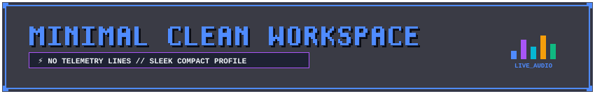

# 📦 README KIT — КАТАЛОГ КОМПОНЕНТОВ (РЕПОЗИТОРИИ И ПРОФИЛИ GITHUB)

<div id="top"></div>

<div align="center">


<br/><br/>

<a href="README.md"></a>
&nbsp;&nbsp;
<a href="EXAMPLES.md"></a>
&nbsp;&nbsp;
<a href="#top"></a>

<br/><br/>


</div>

> [!IMPORTANT]
> 📐 **ФУНДАМЕНТАЛЬНЫЙ ПРИНЦИП ДИЗАЙН-СИСТЕМЫ**:
> 1. **Два вектора применения**: оформление **Репозиториев (Repositories Showcase)** и **Профилей разработчиков (Developer Profiles `username/username`)**.
> 2. **Три дизайн-парадигмы**: **Pixel / Retro-Tech** (дизеринг, HUD, радары), **Clean / Modern Vector** (чистые 1px контуры, скругления) и **Minimalist / Corporate** (строгий enterprise и академический стиль).
> 3. **Цветовая палитра (`primary` + `accent` + `preset`)**: полностью независима от формы блоков и поддерживает нативную автоматическую адаптацию под тему пользователя (`mode="auto"`).

---

## 📑 Оглавление каталога

1. [Заглавные шапки (Master Headers — 3 стиля)](#1-заглавные-шапки-master-headers--3-стиля)
2. [Закрывающие пластины (Master Footers — 3 стиля во всю ширину)](#2-закрывающие-пластины-master-footers--3-стиля-во-всю-ширину)
3. [Инлайн-плашки и алерты (Callouts)](#3-инлайн-плашки-и-алерты-callouts)
4. [Плашки для цитат (Quote Headers)](#4-плашки-для-цитат-quote-headers)
5. [Рамки окон (Window Frames)](#5-рамки-окон-window-frames)
6. [Интерактивные терминалы (Collapsible Terminals)](#6-интерактивные-терминалы-collapsible-terminals)
7. [Чипы и пилюли (Chips & Pills — Адаптивная ширина)](#7-чипы-и-пилюли-chips--pills--адаптивная-ширина)
8. [Разделители и сплиттеры подмодулей](#8-разделители-и-сплиттеры-подмодулей)
9. [Мульти-режимность (Auto Dark/Light Modes)](#9-мульти-режимность-auto-darklight-modes)
10. [Метрики ключевых показателей (Metrics KPI Cards v4.0)](#10-метрики-ключевых-показателей-metrics-kpi-cards-v40)
11. [Сегментированные шкалы прогресса (Progress HUD Bars v4.0)](#11-сегментированные-шкалы-прогресса-progress-hud-bars-v40)
12. [Матрица технологий и пиксельные иконки (Tech Stack Matrix v4.0)](#12-матрица-технологий-и-пиксельные-иконки-tech-stack-matrix-v40)
13. [Интерактивные PCB-таймлайны (Timelines v4.0)](#13-интерактивные-pcb-таймлайны-timelines-v40)
14. [Социальные карточки OpenGraph 1280x640 (Social Cards v4.0)](#14-социальные-карточки-opengraph-1280x640-social-cards-v40)
15. [Компактный режим шапки (Compact Header ~84px v4.0)](#15-компактный-режим-шапки-compact-header-84px-v40)
16. [График динамики звёзд и роста (Star Growth Trend Chart v5.0)](#16-график-динамики-звёзд-и-роста-star-growth-trend-chart-v50)
17. [Карточка разработчика для шапки профиля (Developer Dossier Profile Card v5.0)](#17-карточка-разработчика-для-шапки-профиля-developer-dossier-profile-card-v50)

---

## 1. Заглавные шапки (Master Headers — 3 стиля)

### 1.1 Cyberpunk Terminal (Радар 360° + CRT Scanline + Эквалайзер + Теги 3 уровня)


<br/>

### 1.2 Tactical Military HUD (Прицельный лазер + 45° Chamfers + Теги 3 уровня)


<br/>

### 1.3 Minimal Glass (Частотный эквалайзер спектра + Теги 3 уровня)


<br/>

### 1.4 Чистая версия шапки (Без тегов 3 уровня — область под подзаголовком чистая)


---

## 2. Закрывающие пластины (Master Footers — 3 стиля во всю ширину)

### 2.1 Cyberpunk Terminal Footer
<a href="#top"></a>

<br/>

### 2.2 Tactical Military Footer
<a href="#top"></a>

<br/>

### 2.3 Minimal Glass Footer
<a href="#top"></a>

---

## 3. Инлайн-плашки и алерты (Callouts)

### 3.1 Cyberpunk Note


<br/>

### 3.2 Tactical Warning


<br/>

### 3.3 Minimal Info


---

## 4. Плашки для цитат (Quote Headers)

Плашки цитат имеют открытый левый край (стыкующийся с серой полосой цитаты GitHub) и пунктирную нижнюю линию:

### 4.1 Cyberpunk Quote Header
> 
>
> > **Живой текст цитаты**: плашка бесшовно открыта слева к серой линии `border-left`, а пунктирная нижняя линия направляет внимание оператора в текст.

<br/>

### 4.2 Tactical Quote Header
> 
>
> > **Тактическое оповещение**: плашка цитаты в тактическом стиле идеально выравнивается по высоте со стандартной серой чертой цитирования GitHub.

<br/>

### 4.3 Minimal Quote Header
> 
>
> > **Минималистичная цитата**: лёгкая элегантная рамка без перегрузки интерфейса.

---

## 5. Рамки окон (Window Frames)

### 5.1 Cyberpunk Window (Скобы-кронштейны + Накрытие x=1..849)


<table width="100%">
<tr>
<td width="2000">

#### Живой Markdown контент внутри окна
- Окно накрывает таблицу на 100% ширины.
- Код, списки и формулы остаются доступными для копирования.

</td>
</tr>
</table>


<br/>

### 5.2 Tactical Window (45° Chamfers без прокладки)


<table width="100%">
<tr>
<td width="2000">

#### Тактический блок данных
- Скосы 45° на углах крышек ложатся ровно на серые рамки GitHub.
- Полная адаптивность на любых экранах.

</td>
</tr>
</table>


<br/>

### 5.3 Minimal Glass Window (Монолитная таблица `table_minimal`)
<table width="100%">
<tr>
<td width="100%" align="center">

</td>
</tr>
<tr>
<td width="2000">

#### Интегрированный 3-строчный монолит
- Верхняя крышка, контент и нижняя рамка объединены в единую монолитную таблицу.
- Никаких двойных серых рамок.

</td>
</tr>
<tr>
<td width="100%" align="center">

</td>
</tr>
</table>

---

## 6. Интерактивные терминалы (Collapsible Terminals)

### 6.1 Cyberpunk Terminal
<details open>
<summary><kbd>▶ HUD.TERMINAL // DEPLOY.SYS</kbd> <b>[ НАЖМИТЕ ДЛЯ СВОРАЧИВАНИЯ / РАЗВОРАЧИВАНИЯ ]</b> <code>[STATE: EXPANDED]</code></summary>

<br/>


<table width="100%">
<tr>
<td width="2000">

```bash
git clone https://github.com/Kazinagg/pixel-readme-kit.git
cd pixel-readme-kit
python -m generator.cli --help
```

</td>
</tr>
</table>


</details>

<br/>

### 6.2 Minimal Terminal (Свернутый по умолчанию)
<details >
<summary><kbd>▶ MINIMAL.TERMINAL // KERNEL</kbd> <b>[ НАЖМИТЕ ДЛЯ СВОРАЧИВАНИЯ / РАЗВОРАЧИВАНИЯ ]</b> <code>[CLICK TO EXPAND]</code></summary>

<br/>


<table width="100%">
<tr>
<td width="2000">

```bash
# Быстрая сборка README
python -m generator.cli compile --input README.template.md --output README.md
```

</td>
</tr>
</table>


</details>

---

## 7. Чипы и пилюли (Chips & Pills — Адаптивная ширина)

Размер чипов автоматически адаптируется под количество символов текста и эмодзи:

### 7.1 Cyberpunk Chips

&nbsp;&nbsp;

&nbsp;&nbsp;


<br/><br/>

### 7.2 Tactical Military Chips

&nbsp;&nbsp;

&nbsp;&nbsp;


<br/><br/>

### 7.3 Minimal Glass Chips

&nbsp;&nbsp;

&nbsp;&nbsp;


---

## 8. Разделители и сплиттеры подмодулей

### 8.1 Cyberpunk PCB Divider (Бегущий пакет данных)


<br/>

### 8.2 Tactical Laser Divider (Прицельный луч)


<br/>

### 8.3 Minimal Spectrum Divider (Частотный эквалайзер)


<br/>

### 8.4 Сплиттеры подмодулей (Flush x=1..849)

<br/>

<br/>


---

## 9. Мульти-режимная адаптация (Multi-Mode Themes v3.0)

Каждый компонент поддерживает атрибут `mode="..."` (`auto`, `dark`, `light`, `transparent`, `gh`, `picture`).

### 9.1 Режим `mode="auto"` (Адаптивный SVG по умолчанию)
Автоматически адаптирует цвета к теме ОС или GitHub:


<br/>

### 9.2 Режим `mode="dark"` (Всегда тёмная палитра)


<br/>

### 9.3 Режим `mode="light"` (Всегда светлая палитра)


<br/>

### 9.4 Режим `mode="transparent"` (Прозрачный фон)


---

## 10. Метрики ключевых показателей (Metrics KPI Cards v4.0)

Полноширинные карточки для отображения бенчмарков, статусов и аналитики с угловыми скобами и трендами:


---

## 11. Сегментированные шкалы прогресса (Progress HUD Bars v4.0)

Научно-фантастические шкалы с пиксельным дизерингом и динамическим бейджем:


---

## 12. Матрица технологий и пиксельные иконки (Tech Stack Matrix v4.0)

Сетка карточек с векторными пиксельными иконками (Python, C++, Rust, Docker, Linux, Git, OpenGL и др.):


---

## 13. Интерактивные PCB-таймлайны (Timelines v4.0)

Вертикальные шины данных для демонстрации релизов, этапов дорожной карты и статусов задач:


---

## 14. Социальные карточки OpenGraph 1280x640 (Social Cards v4.0)

Премиальные баннеры для превью репозитория при шеринге в Twitter, LinkedIn, Telegram и Discord:


---

## 15. Компактный режим шапки (Compact Header ~84px v4.0)

Облегченный вариант без телеметрии и радара — идеален для мобильных экранов и лаконичных README:


---

## 16. График динамики звёзд и роста (Star Growth Trend Chart v5.0)

Полноширинный векторный SVG-график (850×230) с координатной сеткой, градиентной заливкой области (Area Fill), пиковыми метками и индикацией темпа прироста для репозиториев и профилей:


---

## 17. Карточка разработчика для шапки профиля (Developer Dossier Profile Card v5.0)

Флагманская карточка (850×190) для оформления шапки профиля разработчика `username/username` со стилизованным аватаром, LED-индикатором статуса, 3D-типографикой и био:


<br/><br/>

<a href="#top"></a>

