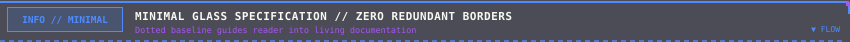

# 📦 PIXEL README KIT — КАТАЛОГ КОМПОНЕНТОВ (3 ГЛОБАЛЬНЫХ СТИЛЯ)

<div id="top"></div>

<div align="center">


<br/><br/>

<a href="SHOWCASE.md"> <b>[ 🏛️ ВИЗУАЛЬНЫЙ SHOWCASE ]</b></a>
&nbsp;&nbsp;
<a href="#top"> <b>[ ▲ НАВЕРХ ]</b></a>

<br/><br/>

<!-- ANIMATED FREQUENCY SPECTRUM DIVIDER (MINIMAL GLASS) -->


</div>

> [!IMPORTANT]
> 📐 **ФУНДАМЕНТАЛЬНЫЙ ПРИНЦИП ДИЗАЙН-СИСТЕМЫ**:
> 1. **Стиль (Форма и Геометрия)**: существует ровно **3 канонических стиля** — **Cyberpunk**, **Tactical Military** и **Minimal Glass**.
> 2. **Цветовая палитра (`primary` + `accent`)**: полностью независима от формы. В каталоге стили демонстрируются в канонических цветах:
>    - 🟢 **Cyberpunk** ➔ Neon Cyan (`#00C8D7`) / Purple (`#A855F7`)
>    - 🟡 **Tactical Military** ➔ Amber Phoshor (`#F59E0B`) / Alert Orange (`#EA580C`)
>    - 🟣 **Minimal Glass** ➔ Tokyo Neon Blue (`#4F8BFF`) / Magenta (`#A855F7`)

---

## 📑 Оглавление каталога

1. [Три глобальных стиля: архитектурная матрица](#1-три-глобальных-стиля-архитектурная-матрица)
2. [Заглавные шапки (Master Headers — 3 стиля)](#2-заглавные-шапки-master-headers--3-стиля)
3. [Закрывающие пластины (Master Footers — 3 стиля во всю ширину)](#3-закрывающие-пластины-master-footers--3-стиля-во-всю-ширину)
4. [Инлайн-плашки и алерты (Callouts)](#4-инлайн-плашки-и-алерты-callouts)
   - [4.1 Автономные плашки (3 стиля геометрии)](#41-автономные-плашки-3-стиля-геометрии)
   - [4.2 Подкласс: Плашки для цитат `> ` (Открытый левый край + пунктирный низ)](#42-подкласс-плашки-для-цитат---открытый-левый-край--пунктирный-низ)
5. [Рамки окон (Window Frames — 3 стиля без прокладок)](#5-рамки-окон-window-frames--3-стиля-без-прокладок)
   - [5.1 Cyberpunk Brackets (Cyan)](#51-cyberpunk-brackets-cyan)
   - [5.2 Tactical Chamfer 45° (Amber)](#52-tactical-chamfer-45-amber)
   - [5.3 Minimal Glass Monolith (Tokyo Blue)](#53-minimal-glass-monolith-tokyo-blue)
6. [Интерактивный терминал `<details><summary>` (Надежный триггер без сбоев)](#6-интерактивный-терминал-detailssummary-надежный-триггер-без-сбоев)
7. [Разделители глав и сплиттеры (Dividers & Splitters — 3 стиля)](#7-разделители-глав-и-сплиттеры-dividers--splitters--3-стиля)
   - [7.1 Глобальные разделители (PCB, Laser, Frequency Spectrum)](#71-глобальные-разделители-между-главами--3-стиля)
   - [7.2 Внутренние сплиттеры подмодулей (Flush x=1..849)](#72-внутренние-сплиттеры-подмодулей-flush-x1849-без-боковых-щелей)
8. [Пиксельные маркеры списков (Pixel Bullets 14×14)](#8-пиксельные-маркеры-списков-pixel-bullets-1414)
9. [Голографические чипы и бейджи (Chips & Pills)](#9-голографические-чипы-и-бейджи-chips--pills)

---

<div id="1-три-глобальных-стиля-архитектурная-матрица"></div>

## 1. 🏛️ Три глобальных стиля: архитектурная матрица

| Характеристика | 🟢 Cyberpunk Terminal | 🟡 Tactical Military HUD | 🟣 Minimal Glass |
| :--- | :--- | :--- | :--- |
| **Геометрия формы** | Прямые углы, открытые скобы (Brackets), направляющие зубцы | 45° срезанные фаски (Chamfers), шевроны `▲ / ▼` | Ультратонкие шины, угловые зацепы `┌ ┐` и `└ ┘` |
| **Анимация** | 360° радар, CRT-сканлайн, бегущий по плате PCB-пакет | Пульсирующий прицельный лазер, маркеры целей | Спектральный частотный эквалайзер, точечные маяки |
| **Интеграция с таблицей** | Прямое накрытие 1-ячеечной таблицы зубцами `x=1..849` | Прямое накрытие таблицы фасками без переходных прокладок | Монолитная 3-строчная таблица без двойных рамок (`table_minimal`) |
| **Цвет в каталоге** | Неоновый бирюзовый (`#00C8D7`) + Пурпур (`#A855F7`) | Янтарный фосфор (`#F59E0B`) + Сигнальный оранж (`#EA580C`) | Токио неон (`#4F8BFF`) + Фиолетовый / Монохром |

---

<div id="2-заглавные-шапки-master-headers--3-стиля"></div>

## 2. 🏛️ Заглавные шапки (Master Headers — 3 стиля)

Флагманские титульные баннеры для верхней части репозитория или профиля.

### 2.1 Cyberpunk 3D Workstation (Радар 360° + CRT Scanline + Эквалайзер)
- **Файл**: `assets/headers/header-terminal-cyberpunk.svg`
- **Размер**: `850×260` (адаптивный `100%`)


```html

```

<br/>

### 2.2 Tactical Military HUD (Прицельный лазер + Скосы 45°)
- **Файл**: `assets/headers/header-tactical-amber.svg`
- **Размер**: `850×220` (адаптивный `100%`)


```html

```

<br/>

### 2.3 Minimal Glass & Live Equalizer
- **Файл**: `assets/headers/header-minimal-tokyo.svg`
- **Размер**: `850×135` (адаптивный `100%`)


```html

```

---

<div id="3-закрывающие-пластины-master-footers--3-стиля-во-всю-ширину"></div>

## 3. 🏁 Закрывающие пластины (Master Footers — 3 стиля во всю ширину)

Монументальные завершающие пластины профиля со статусом сессии и навигационной кнопкой возврата наверх `[ ▲ RETURN TO TOP ]`.  
Отображаются на полную ширину `100%` без табличных рамок:

### 3.1 Cyberpunk Terminal Footer
- **Файл**: `assets/footers/footer-terminal-cyberpunk.svg`
- **Размер**: `850×54` (адаптивный `100%`)

<a href="#top"></a>

```html
<a href="#top"></a>
```

<br/>

### 3.2 Tactical Military Footer
- **Файл**: `assets/footers/footer-tactical-amber.svg`
- **Размер**: `850×54` (адаптивный `100%`)

<a href="#top"></a>

```html
<a href="#top"></a>
```

<br/>

### 3.3 Minimal Glass Footer
- **Файл**: `assets/footers/footer-minimal-tokyo.svg`
- **Размер**: `850×54` (адаптивный `100%`)

<a href="#top"></a>

```html
<a href="#top"></a>
```

---

<div id="4-инлайн-плашки-и-алерты-callouts"></div>

## 4. 💬 Инлайн-плашки и алерты (Callouts)

### 4.1 Автономные плашки (3 стиля геометрии)

Полностью закрытые независимые плашки для размещения в основном тексте:

#### 1. Cyberpunk Callout (Клеммы, угловые пиксели и LED)
- **Файл**: `assets/callouts/callout-cyberpunk-note.svg`


```html

```

<br/>

#### 2. Tactical Military Callout (Фаски 45°, шевроны и сигнальные полосы)
- **Файл**: `assets/callouts/callout-tactical-warning.svg`


```html

```

<br/>

#### 3. Minimal Glass Callout (Тонкая рамка и угловые маркеры)
- **Файл**: `assets/callouts/callout-minimal-note.svg`


```html

```

<br/>

---

### 4.2 Подкласс: Плашки для цитат `> ` (Открытый левый край + пунктирный низ)

> [!TIP]
> **ОСОБЕННОСТЬ ПОДКЛАССА**:
> 1. **Левая грань убрана**: плашка не создает двойную линию, а бесшовно открывается навстречу вертикальной линии цитаты `border-left` от GitHub.
> 2. **Нижняя грань сделана пунктирной**: визуальный мост показывает, что важная информация — это не только плашка, но и весь живой текст, идущий ниже внутри цитаты.

#### 1. Cyberpunk Quote Header
- **Файл**: `assets/callouts/callout-quote-cyberpunk-cyan.svg`

> 
>
> **Живой текст внутри цитаты**: плашка бесшовно открыта слева к полосе цитаты, а нижняя пунктирная линия мягко направляет внимание на текстовое содержимое ниже.

```markdown
> 
>
> **Живой текст цитаты**: описание спецификации или правила...
```

<br/>

#### 2. Tactical Military Quote Header
- **Файл**: `assets/callouts/callout-quote-tactical-amber.svg`

> 
>
> **Критическое предупреждение**: тактическая сигнальная линия открыта слева и направляет поток внимания на важные эксплуатационные ограничения ниже.

```markdown
> 
>
> **Внимание**: текст предупреждения об ограничениях...
```

<br/>

#### 3. Minimal Glass Quote Header
- **Файл**: `assets/callouts/callout-quote-minimal-tokyo.svg`

> 
>
> **Минималистичная справка**: тонкая стеклянная направляющая с точечным пунктиром, плавно перетекающим в текст документации.

```markdown
> 
>
> **Информация**: текст пояснения архитектуры...
```

---

<div id="5-рамки-окон-window-frames--3-стиля-без-прокладок"></div>

## 5. 🪟 Рамки окон (Window Frames — 3 стиля без прокладок)

Все направляющие зубцы и внешние контуры фреймов выведены строго на **`x=1` и `x=849`**.  
Фреймы накрывают 100% ширины таблицы напрямую без адаптеров-прокладок:

### 5.1 Cyberpunk Brackets (Cyan)
- **Верх**: `assets/frames/frame-top-brackets-cyan.svg`
- **Низ**: `assets/frames/frame-bottom-brackets-cyan.svg`


<table width="100%">
<tr>
<td width="100%">

#### 🧬 CYBERPUNK WINDOW // DIRECT TABLE CAPPING
Зубцы верхней и нижней крышек на `x=1` и `x=849` садятся прямо на внешние 1px серые грани таблицы.

</td>
</tr>
</table>


```html

<table width="100%">
  <tr><td width="100%">Текст окна...</td></tr>
</table>

```

<br/>

### 5.2 Tactical Chamfer 45° (Amber)
- **Верх**: `assets/frames/frame-top-chamfer-amber.svg`
- **Низ**: `assets/frames/frame-bottom-chamfer-amber.svg`


<table width="100%">
<tr>
<td width="100%">

#### ⚡ TACTICAL WINDOW // ZERO SHOULDER ADAPTERS
Фаски на `x=1` и `x=849` точно совпадают с гранями таблицы. Прокладки полностью устранены.

</td>
</tr>
</table>


```html

<table width="100%">
  <tr><td width="100%">Текст окна...</td></tr>
</table>

```

<br/>

### 5.3 Minimal Glass Monolith (Tokyo Blue)
- **Верх**: `assets/frames/frame-top-table-minimal-tokyo.svg`
- **Низ**: `assets/frames/frame-bottom-table-minimal-tokyo.svg`
- **Принцип**: шапка и поддон помещены **внутрь строк единой таблицы**. В SVG убран замкнутый прямоугольник, а нативная серая рамка GitHub становится основным корпусом окна.

<table width="100%">
<tr>
<td width="100%" align="center">

</td>
</tr>
<tr>
<td width="100%">

#### 🟣 MINIMAL GLASS // TOKYO MONOLITH
- Внешняя рамка: нативная 1px серая рамка таблицы GitHub.
- Разделитель строк: технологический шов под шапкой.
- Угловые зацепы `┌ ┐` и `└ ┘` внутри SVG обнимают внутренние углы ячеек.

</td>
</tr>
<tr>
<td width="100%" align="center">

</td>
</tr>
</table>

```html
<table width="100%">
  <tr><td width="100%" align="center"></td></tr>
  <tr><td width="100%">Текст окна...</td></tr>
  <tr><td width="100%" align="center"></td></tr>
</table>
```

---

<div id="6-интерактивный-терминал-detailssummary-надежный-триггер-без-сбоев"></div>

## 6. 📱 Интерактивный терминал `<details><summary>` (Надежный триггер без сбоев)

> [!WARNING]
> **ОГРАНИЧЕНИЕ GITHUB ДЛЯ ТЕГОВ `` ВНУТРИ `<summary>`**:
> На GitHub веб-интерфейс автоматически навешивает на большие теги `` встроенный просмотрщик изображений (lightbox viewer).  
> Поэтому если картинка стоит в `<summary>` одна, клик по ней **открывает SVG в браузере как картинку**, а не раскрывает блок!

### 💡 Надежное решение: Стилизованная строка триггера `<summary>`
Когда триггер оформлен через текст, эмодзи и блочные моноширинные теги `<code>` / `<b>`:
- Клик **100% надежно раскрывает/сворачивает блок на месте**.
- **Никаких прыжков по скроллу** и переходов по URL-хэшу `#`.
- Внутри блока раскрывается полноценный терминал с шапкой, таблицей и поддоном!

### 6.1 Пример 1: Открыт по умолчанию (Cyberpunk) — Нажмите, чтобы свернуть
<details open>
<summary><kbd>▶ HUD.TERMINAL</kbd> <b>[ НАЖМИТЕ ДЛЯ СВОРАЧИВАНИЯ / РАЗВОРАЧИВАНИЯ ]</b> <code>[STATE: EXPANDED]</code> <code>[ONLINE]</code></summary>

<br/>


<table width="100%">
<tr>
<td width="100%">

#### 🔴 ИНТЕРАКТИВНЫЙ ТЕРМИНАЛ // СОДЕРЖИМОЕ
- Идеально для длинных логов, тяжелых таблиц и скрытых параметров.
- Раскрывается и скрывается в один клик без перезагрузки и без скролла страницы.

```bash
# Пример команды терминала
git clone https://github.com/Kazinagg/pixel-readme-kit.git
```

</td>
</tr>
</table>


</details>

<br/>

### 6.2 Пример 2: Свернут по умолчанию (Minimal Glass) — Нажмите, чтобы раскрыть
<details>
<summary><kbd>▶ SYSTEM.LOGS</kbd> <b>[ РАСКРЫТЬ СИСТЕМНЫЕ ЛОГИ // CLICK TO EXPAND ]</b> <code>[STATE: COLLAPSED]</code></summary>

<br/>

<table width="100%">
<tr>
<td width="100%" align="center">

</td>
</tr>
<tr>
<td width="100%">

```text
[2026-09-26 15:30:00] [SYSTEM] Initializing Pixel Readme Kit engine...
[2026-09-26 15:30:01] [GRAPHICS] Loading 3 global styles: Cyberpunk, Tactical, Minimal Glass.
[2026-09-26 15:30:02] [DRAWER] Interactive drawer toggled successfully with 0ms delay.
[2026-09-26 15:30:03] [STATUS] All systems operational [100% PASS].
```

</td>
</tr>
<tr>
<td width="100%" align="center">

</td>
</tr>
</table>

</details>

```html
<details>
  <summary><kbd>▶ HUD.TERMINAL</kbd> <b>[ НАЖМИТЕ ДЛЯ СВОРАЧИВАНИЯ / РАЗВОРАЧИВАНИЯ ]</b> <code>[ONLINE]</code></summary>
  <br/>
  <!-- Любой блок контента: рамка, таблица или код -->
</details>
```

---

<div id="7-разделители-глав-и-сплиттеры-dividers--splitters--3-стиля"></div>

## 7. ⚡ Разделители глав и сплиттеры (Dividers & Splitters — 3 стиля)

### 7.1 Глобальные разделители (Между главами — 3 стиля)

#### 1. Cyberpunk PCB Divider (Печатная плата с бегущим пакетом)
- **Файл**: `assets/divider-pcb-cyan.svg`


```html

```

<br/>

#### 2. Tactical Laser Divider (Пульсирующий прицельный лазер)
- **Файл**: `assets/divider-laser-amber.svg`


```html

```

<br/>

#### 3. Minimal Glass Frequency Spectrum Divider (Частотный эквалайзер)
- **Файл**: `assets/divider-minimal-spectrum.svg`


```html

```

---

### 7.2 Внутренние сплиттеры подмодулей (Flush x=1..849 без боковых щелей)

#### 1. Terminal T-Junction Splitter (Cyberpunk)
- **Файл**: `assets/splitters/splitter-terminal-cyberpunk.svg`


<br/>

#### 2. Tactical Chevron Splitter (Tactical Military)
- **Файл**: `assets/splitters/splitter-tactical-amber.svg`


<br/>

#### 3. Minimal Decay Dither Splitter (Minimal Glass)
- **Файл**: `assets/splitters/splitter-decay-tokyo.svg`


---

<div id="8-пиксельные-маркеры-списков-pixel-bullets-1414"></div>

## 8. 🎯 Пиксельные маркеры списков (Pixel Bullets 14×14)

16 специализированных 14×14px SVG-иконок для оформления списков, сгруппированных по 3 стилям:

<table width="100%">
  <tr>
    <th width="33%">🟢 Cyberpunk</th>
    <th width="33%">🟡 Tactical Military</th>
    <th width="34%">🟣 Minimal Glass</th>
  </tr>
  <tr>
    <td valign="top">
      •  <code>bullet-diamond-cyan</code><br/>
      •  <code>bullet-arrow-pink</code><br/>
      •  <code>bullet-marker-cyan</code><br/>
      •  <code>bullet-check-cyan</code>
    </td>
    <td valign="top">
      •  <code>bullet-chevron-amber</code><br/>
      •  <code>bullet-plus-amber</code><br/>
      •  <code>bullet-minus-amber</code><br/>
      •  <code>bullet-alert-amber</code><br/>
      •  <code>bullet-stripe-amber</code>
    </td>
    <td valign="top">
      •  <code>bullet-square-green</code><br/>
      •  <code>bullet-dither-light</code><br/>
      •  <code>bullet-dither-med</code><br/>
      •  <code>bullet-prompt-green</code><br/>
      •  <code>bullet-star-blue</code>
    </td>
  </tr>
</table>

---

<div id="9-голографические-чипы-и-бейджи-chips--pills"></div>

## 9. 💎 Голографические чипы и бейджи (Chips & Pills — 3 стиля формы и распада)

Компактные полупрозрачные бейджи для статусов, тегов, веток и ссылок.  
Каждый стиль обладает **собственной уникальной геометрией формы корпуса** и **собственным алгоритмом распада/растворения (Decay)**:

### 9.1 Архитектурная матрица чипов

| Элемент / Характеристика | 🟢 Cyberpunk Terminal | 🟡 Tactical Military HUD | 🟣 Minimal Glass |
| :--- | :--- | :--- | :--- |
| **Геометрия формы** | Прямые углы, пиксельные замки `3×3`, открытые скобы | 45° срезанные фаски (Chamfers), октагон, шевроны `▲` | Волосяная рамка 1px (Hairline), угловые зацепы `┌ ┐` и `└ ┘` |
| **Физика распада (Decay)** | **Матричный пиксельный дизеринг**: блоки пикселей `3×3`, `2×2`, `1×1` отлетают как цифровой глитч | **Диагональные полосы фасок `///`**: 45° наклонные зубчатые сегменты, убывающие по высоте и alpha | **Микроточечное рассеивание**: матрица микро-stipple точек 1px и тающая пунктирная шина стекла |
| **1. Замкнутый блок** |  |  |  |
| **2. Блок с распадом** |  |  |  |
| **3. Живой статус / Маяк** |  |  |  |

<br/>

### 9.2 Разбор стилей и примеры кода

#### 1. Cyberpunk Chips (Скобы, угловые пиксели и матричный дизеринг)
- **Замкнутый**: `assets/chips/chip-cyberpunk-closed.svg` — классический терминальный чип с пиксельными замками `3×3` по углам.
- **Распад**: `assets/chips/chip-cyberpunk-decay.svg` — правый край растворяется в матричный дизеринг `3×3 ➔ 2×2 ➔ 1×1`.
- **Маяк**: `assets/chips/chip-cyberpunk-pulse.svg` — активный пульсирующий LED-индикатор узла.

```markdown


```

<br/>

#### 2. Tactical Military Chips (45° фаски, шевроны и диагональные срезы `///`)
- **Замкнутый**: `assets/chips/chip-tactical-closed.svg` — 45° срезанные углы с центральными тактическими насечками.
- **Распад**: `assets/chips/chip-tactical-decay.svg` — правый край рассекается наклонными полосами фасок под 45° (`opacity: 0.9 ➔ 0.65 ➔ 0.4 ➔ 0.2`).
- **Маяк**: `assets/chips/chip-tactical-pulse.svg` — прицельный маркер целеуказания с пульсирующим лазером.

```markdown


```

<br/>

#### 3. Minimal Glass Chips (Волосяная шина, зацепы `┌ ┐` и микро-точки стекла)
- **Замкнутый**: `assets/chips/chip-minimal-closed.svg` — тончайшая рамка 1px с угловыми насечками `┌ ┐ └ ┘`.
- **Распад**: `assets/chips/chip-minimal-decay.svg` — шина переходит в пунктир и растворяется созвездием микроточек матированного стекла.
- **Маяк**: `assets/chips/chip-minimal-pulse.svg` — плавный «дышащий» маяк фоновой синхронизации.

```markdown


```

---

<div align="center">

<a href="#top"></a>

<br/><br/>

<a href="SHOWCASE.md"> <b>[ ⬅️ ПЕРЕЙТИ В ПОЛНЫЙ SHOWCASE README ]</b></a>

<br/><br/>

<sub>PIXEL README KIT v2.2 &bull; 3 GLOBAL STYLES SPECIFICATION &bull; 2026</sub>

</div>
