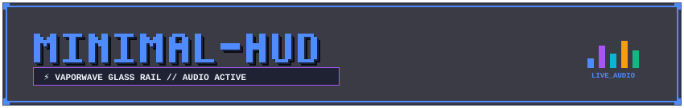
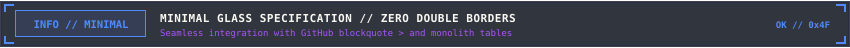
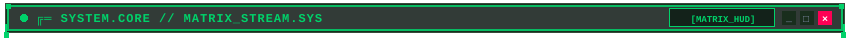
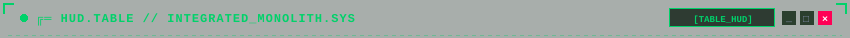
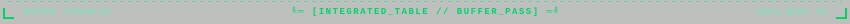
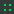
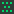

# 📦 PIXEL README KIT — КАТАЛОГ КОМПОНЕНТОВ (3 ГЛОБАЛЬНЫХ СТИЛЯ)

<div id="top"></div>

<div align="center">



<br/><br/>

<a href="SHOWCASE.md"> <b>[ 🏛️ ВИЗУАЛЬНЫЙ SHOWCASE ]</b></a>
&nbsp;&nbsp;
<a href="#top"> <b>[ ▲ НАВЕРХ ]</b></a>

<br/><br/>

<!-- ANIMATED FREQUENCY SPECTRUM DIVIDER (MINIMAL GLASS) -->


</div>

> [!IMPORTANT]
> 📐 **ФУНДАМЕНТАЛЬНЫЙ ПРИНЦИП ДИЗАЙН-СИСТЕМЫ**:
> 1. **Стиль (Форма и Геометрия)**: существует ровно **3 канонических стиля** — **Cyberpunk**, **Tactical Military** и **Minimal Glass**. Стиль определяет скосы, фаски, зацепы и анимации.
> 2. **Цветовая палитра (`primary` + `accent`)**: полностью независима от формы. Пользователь может взять тактическую форму и покрасить её в синий, или взять минималистичную форму и сделать матрично-зеленой.

---

## 📑 Оглавление каталога

1. [Три глобальных стиля: архитектурная матрица](#1-три-глобальных-стиля-архитектурная-матрица)
2. [Заглавные шапки (Master Headers — 3 стиля)](#2-заглавные-шапки-master-headers--3-стиля)
3. [Закрывающие пластины (Master Footers — 3 стиля)](#3-закрывающие-пластины-master-footers--3-стиля)
4. [Инлайн-плашки и алерты (Callouts — 3 стиля геометрии)](#4-инлайн-плашки-и-алерты-callouts--3-стиля-геометрии)
5. [Рамки окон (Window Frames — 3 стиля без прокладок)](#5-рамки-окон-window-frames--3-стиля-без-прокладок)
6. [Интерактивный терминал `<details><summary>` (SVG-кнопка без прыжков)](#6-интерактивный-терминал-detailssummary-svg-кнопка-без-прыжков)
7. [Разделители глав и сплиттеры (Dividers & Splitters — 3 стиля)](#7-разделители-глав-и-сплиттеры-dividers--splitters--3-стиля)
8. [Пиксельные маркеры списков (Pixel Bullets 14×14)](#8-пиксельные-маркеры-списков-pixel-bullets-1414)
9. [Голографические чипы и бейджи (Chips & Pills)](#9-голографические-чипы-и-бейджи-chips--pills)

---

<div id="1-три-глобальных-стиля-архитектурная-матрица"></div>

## 1. 🏛️ Три глобальных стиля: архитектурная матрица

| Характеристика | 🟢 Cyberpunk Terminal | 🟡 Tactical Military HUD | 🟣 Minimal Glass |
| :--- | :--- | :--- | :--- |
| **Геометрия формы** | Прямые углы, открытые скобы (Brackets), направляющие зубцы | 45° срезанные фаски (Chamfers), шевроны `▲ / ▼` | Ультратонкие шины, угловые зацепы `┌ ┐` и `└ ┘` |
| **Анимация** | 360° радар, CRT-сканлайн, бегущий по плате PCB-пакет | Пульсирующий прицельный лазер, маркеры целей | Спектральный частотный эквалайзер, точечные маяки |
| **Интеграция с таблицей** | Прямое накрытие 1-ячеечной таблицы зубцами `x=1..849` | Прямое накрытие таблицы фасками без переходных прокладок | Монолитная 3-строчная таблица без двойных рамок (`table_minimal`) |
| **Базовая палитра** | Неоновый бирюзовый (`#00C8D7`) + Пурпур (`#A855F7`) | Янтарный фосфор (`#F59E0B`) + Сигнальный оранж (`#EA580C`) | Токио неон (`#4F8BFF`) + Фиолетовый / Монохром |

---

<div id="2-заглавные-шапки-master-headers--3-стиля"></div>

## 2. 🏛️ Заглавные шапки (Master Headers — 3 стиля)

Флагманские титульные баннеры для верхней части репозитория или профиля.

### 2.1 Cyberpunk 3D Workstation (Радар 360° + CRT Scanline + Эквалайзер)
- **Файл**: `assets/headers/header-terminal-cyberpunk.svg`
- **Размер**: `850×260` (адаптивный `100%`)



```html

```

<br/>

### 2.2 Tactical Military HUD (Прицельный лазер + Скосы 45°)
- **Файл**: `assets/headers/header-tactical-amber.svg`
- **Размер**: `850×220` (адаптивный `100%`)



```html

```

<br/>

### 2.3 Minimal Glass & Live Equalizer
- **Файл**: `assets/headers/header-minimal-tokyo.svg`
- **Размер**: `850×135` (адаптивный `100%`)


```html

```

---

<div id="3-закрывающие-пластины-master-footers--3-стиля"></div>

## 3. 🏁 Закрывающие пластины (Master Footers — 3 стиля)

Монументальные завершающие пластины профиля со статусом сессии и навигационной кнопкой возврата наверх `[ ▲ RETURN TO TOP ]`.

<table width="100%">
  <tr>
    <th width="22%">Стиль</th>
    <th width="48%">Превью</th>
    <th width="30%">Путь и код</th>
  </tr>
  <tr>
    <td><b>1. Cyberpunk Core</b></td>
    <td>
      <a href="#top"></a>
    </td>
    <td>
      <code>assets/footers/footer-terminal-cyberpunk.svg</code><br/><br/>
      <code>&lt;a href="#top"&gt;&lt;img src="assets/footers/footer-terminal-cyberpunk.svg" width="100%" /&gt;&lt;/a&gt;</code>
    </td>
  </tr>
  <tr>
    <td><b>2. Tactical Military</b></td>
    <td>
      <a href="#top"></a>
    </td>
    <td>
      <code>assets/footers/footer-tactical-amber.svg</code><br/><br/>
      <code>&lt;a href="#top"&gt;&lt;img src="assets/footers/footer-tactical-amber.svg" width="100%" /&gt;&lt;/a&gt;</code>
    </td>
  </tr>
  <tr>
    <td><b>3. Minimal Glass</b></td>
    <td>
      <a href="#top"></a>
    </td>
    <td>
      <code>assets/footers/footer-minimal-tokyo.svg</code><br/><br/>
      <code>&lt;a href="#top"&gt;&lt;img src="assets/footers/footer-minimal-tokyo.svg" width="100%" /&gt;&lt;/a&gt;</code>
    </td>
  </tr>
</table>

---

<div id="4-инлайн-плашки-и-алерты-callouts--3-стиля-геометрии"></div>

## 4. 💬 Инлайн-плашки и алерты (Callouts — 3 стиля геометрии)

Плашки служат для акцентирования важной документации, предупреждений и критических ошибок.  
Каждый из 3 стилей имеет уникальную форму корпуса, на которую накладывается сигнал:

### 4.1 Cyberpunk Callout (Клеммы, угловые пиксели и LED)
- **Файл**: `assets/callouts/callout-cyberpunk-note.svg`
- **Геометрия**: прямые клеммы, угловые пиксели `5×5`, статус `NOTE // 0x01`.


```html


> **ПРИМЕЧАНИЕ**: Описание системного требования или спецификации...
```

<br/>

### 4.2 Tactical Military Callout (Фаски 45°, шевроны и сигнальные полосы)
- **Файл**: `assets/callouts/callout-tactical-warning.svg`
- **Геометрия**: 45° срез углов, двойные сигнальные полосы, прицельный маркер справа.


```html


> **ВНИМАНИЕ**: Предупреждение об ограничениях окружения или безопасности...
```

<br/>

### 4.3 Minimal Glass Callout (Тонкая рамка и угловые маркеры)
- **Файл**: `assets/callouts/callout-minimal-note.svg`
- **Геометрия**: тонкая hairline-рамка, маркеры `┌ ┐` и `└ ┘`, пульсирующий статус `OK // 0x4F`.



```html


> **ИНФОРМАЦИЯ**: Лаконичное описание функционала в минималистичном стиле...
```

<br/>

### 4.4 Использование плашек внутри цитаты `> ` (Совмещение с полосой GitHub)
Плашки адаптированы для вставки внутрь цитаты `> ` — они автоматически сжимаются под ширину цитаты и выравниваются рядом с левой акцентной линией:

> 
>
> **Живой текст внутри цитаты**: плашка гармонично венчает блок цитаты, а текст продолжается под ней с сохранением левой цветной шины.

---

<div id="5-рамки-окон-window-frames--3-стиля-без-прокладок"></div>

## 5. 🪟 Рамки окон (Window Frames — 3 стиля без прокладок)

> [!NOTE]
> Все направляющие зубцы и внешние контуры фреймов выведены строго на **`x=1` и `x=849`**.  
> **Переходные прокладки больше не требуются**: фреймы накрывают таблицу напрямую!

### 5.1 Cyberpunk Brackets (Открытые скобы с направляющими зубцами)
- **Верх**: `assets/frames/frame-top-brackets-green.svg`
- **Низ**: `assets/frames/frame-bottom-brackets-green.svg`



<table width="100%">
<tr>
<td width="100%">

#### 🧬 CYBERPUNK WINDOW // DIRECT TABLE CAPPING
Зубцы верхней и нижней крышек садятся прямо на внешние 1px серые грани таблицы.

</td>
</tr>
</table>


<br/>

### 5.2 Tactical Chamfer 45° (Скошенные углы без прокладки)
- **Верх**: `assets/frames/frame-top-chamfer-amber.svg`
- **Низ**: `assets/frames/frame-bottom-chamfer-amber.svg`


<table width="100%">
<tr>
<td width="100%">

#### ⚡ TACTICAL WINDOW // ZERO SHOULDER ADAPTERS
Фаски на `x=1` и `x=849` точно совпадают с гранями таблицы. Ноль лишних линий.

</td>
</tr>
</table>


<br/>

### 5.3 Minimal Glass Monolith (`table_minimal` — ноль двойных рамок)
- **Верх**: `assets/frames/frame-top-table-minimal.svg`
- **Низ**: `assets/frames/frame-bottom-table-minimal.svg`
- **Принцип**: шапка и поддон помещены **внутрь строк единой таблицы**. В SVG убран замкнутый прямоугольник, а нативная серая рамка GitHub становится основным корпусом окна.

<table width="100%">
<tr>
<td width="100%" align="center">

</td>
</tr>
<tr>
<td width="100%">

#### 🟢 MINIMAL GLASS // INTEGRATED MONOLITH
- Внешняя рамка: нативная 1px серая рамка таблицы GitHub.
- Разделитель строк: технологический шов под шапкой.
- Угловые зацепы `┌ ┐` и `└ ┘` внутри SVG обнимают внутренние углы ячеек.

</td>
</tr>
<tr>
<td width="100%" align="center">

</td>
</tr>
</table>

---

<div id="6-интерактивный-терминал-detailssummary-svg-кнопка-без-прыжков"></div>

## 6. 📱 Интерактивный терминал `<details><summary>` (SVG-кнопка без прыжков)

Клик в любую область SVG-шапки мягко раскрывает или сворачивает блок **строго на месте** — без перехода по `#` якорю, без изменения URL и без скачков страницы.

### Пример (Cyberpunk Interactive Drawer):
<details open>
<summary></summary>

<table width="100%">
<tr>
<td width="100%">

#### 🔴 ИНТЕРАКТИВНЫЙ ТЕРМИНАЛ // КЛИКАЙТЕ НА ШАПКУ ВЫШЕ
- Шапка внутри `<summary>` работает как нативная кнопка браузера.
- Идеально для длинных логов, тяжелых таблиц и скрытых параметров.

</td>
</tr>
</table>


</details>

```html
<details open>
  <summary></summary>
  <table width="100%">
    <tr><td width="100%">Скрытый контент терминала...</td></tr>
  </table>
  
</details>
```

---

<div id="7-разделители-глав-и-сплиттеры-dividers--splitters--3-стиля"></div>

## 7. ⚡ Разделители глав и сплиттеры (Dividers & Splitters — 3 стиля)

### 7.1 Глобальные разделители (Между главами — 3 стиля)

#### 1. Cyberpunk PCB Divider (Печатная плата с бегущим пакетом)
- **Файл**: `assets/divider-pcb-cyan.svg`


```html

```

<br/>

#### 2. Tactical Laser Divider (Пульсирующий прицельный лазер)
- **Файл**: `assets/divider-laser-amber.svg`


```html

```

<br/>

#### 3. Minimal Glass Frequency Spectrum Divider (Частотный эквалайзер)
- **Файл**: `assets/divider-minimal-spectrum.svg`


```html

```

---

### 7.2 Внутренние сплиттеры подмодулей (Flush x=1..849 без боковых щелей)

#### 1. Terminal T-Junction Splitter (Cyberpunk)
- **Файл**: `assets/splitters/splitter-terminal-cyberpunk.svg`


<br/>

#### 2. Tactical Chevron Splitter (Tactical Military)
- **Файл**: `assets/splitters/splitter-tactical-amber.svg`


<br/>

#### 3. Minimal Decay Dither Splitter (Minimal Glass)
- **Файл**: `assets/splitters/splitter-decay-tokyo.svg`


---

<div id="8-пиксельные-маркеры-списков-pixel-bullets-1414"></div>

## 8. 🎯 Пиксельные маркеры списков (Pixel Bullets 14×14)

16 специализированных 14×14px SVG-иконок для оформления списков, сгруппированных по 3 стилям:

<table width="100%">
  <tr>
    <th width="33%">🟢 Cyberpunk</th>
    <th width="33%">🟡 Tactical Military</th>
    <th width="34%">🟣 Minimal Glass</th>
  </tr>
  <tr>
    <td valign="top">
      •  <code>bullet-diamond-cyan</code><br/>
      •  <code>bullet-arrow-pink</code><br/>
      •  <code>bullet-marker-cyan</code><br/>
      •  <code>bullet-check-cyan</code>
    </td>
    <td valign="top">
      •  <code>bullet-chevron-amber</code><br/>
      •  <code>bullet-plus-amber</code><br/>
      •  <code>bullet-minus-amber</code><br/>
      •  <code>bullet-alert-amber</code><br/>
      •  <code>bullet-stripe-amber</code>
    </td>
    <td valign="top">
      •  <code>bullet-square-green</code><br/>
      •  <code>bullet-dither-light</code><br/>
      •  <code>bullet-dither-med</code><br/>
      •  <code>bullet-prompt-green</code><br/>
      •  <code>bullet-star-blue</code>
    </td>
  </tr>
</table>

---

<div id="9-голографические-чипы-и-бейджи-chips--pills"></div>

## 9. 💎 Голографические чипы и бейджи (Chips & Pills)

Компактные бейджи со стеклянным фоном для папок, тегов, версий и ссылок.

<table width="100%">
  <tr>
    <th width="15%">Тип</th>
    <th width="30%">Превью</th>
    <th width="30%">Файл</th>
    <th width="25%">Стиль формы</th>
  </tr>
  <tr>
    <td><b>Closed Pill</b></td>
    <td></td>
    <td><code>chip-closed-core.svg</code></td>
    <td>Cyberpunk (скругление 2px)</td>
  </tr>
  <tr>
    <td><b>Chamfer 45°</b></td>
    <td></td>
    <td><code>chip-chamfer-spec.svg</code></td>
    <td>Tactical (срез 45°)</td>
  </tr>
  <tr>
    <td><b>Decay Right</b></td>
    <td></td>
    <td><code>chip-decay-right-done.svg</code></td>
    <td>Minimal Glass (растворение)</td>
  </tr>
  <tr>
    <td><b>Pulse Beacon</b></td>
    <td></td>
    <td><code>chip-pulse-online.svg</code></td>
    <td>Cyberpunk (живой маяк)</td>
  </tr>
</table>

---

<div align="center">

<a href="#top"></a>

<br/><br/>

<a href="SHOWCASE.md"> <b>[ ⬅️ ПЕРЕЙТИ В ПОЛНЫЙ SHOWCASE README ]</b></a>

<br/><br/>

<sub>PIXEL README KIT v2.2 &bull; 3 GLOBAL STYLES SPECIFICATION &bull; 2026</sub>

</div>
