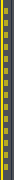
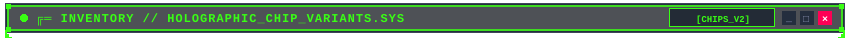
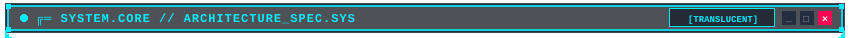
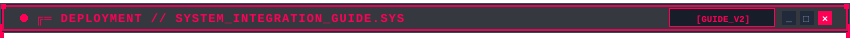

<div align="center">


<br/>

<!-- NAVIGATION PILLS -->
<a href="#mode-a-open-cyber-brackets-hud"></a>
<a href="#mode-b-full-box-enclosure"></a>
<a href="#holographic-chips-taxonomy"></a>
<a href="#architecture--translucency"></a>
<a href="#quick-start--cli-generator"></a>

<br/><br/>


</div>

## 📌 OVERVIEW // О ПРОЕКТЕ

**Pixel Readme Kit** — модульная дизайн-система в эстетике ретро-киберпанка, пиксельных HUD-интерфейсов и полупрозрачных неоновых терминалов. 

Создана для оформления GitHub профилей и репозиториев без недостатков статических картинок:
- 🧊 **Полупрозрачный фон (True Alpha Blending)**: `rgba(10, 14, 23, 0.72)` адаптируется к любой теме GitHub (Dark, Dimmed, High Contrast, Light) без неестественных черных прямоугольников.
- 📋 **100% Копируемый текст и формулы**: Вся важная документация, команды терминала и LaTeX-формулы остаются живым Markdown-текстом внутри визуальных фреймов.
- 📐 **Два режима обрамления**: 
  1. *Mode A (Open Cyber Brackets)* — открытые скобы `┌───┐` и `└───┘` с направляющими зубцами.
  2. *Mode B (Full Box Enclosure)* — полный замкнутый контур с вертикальными рельсами (`rail-left.svg` / `rail-right.svg`).
- 💫 **Плавное перетекание (Decay Chips)**: Рассеянный дизеринг пикселей (`decay_right` / `decay_left`), позволяющий чипам плавно растворяться в тексте или выходить из него.

---

<div id="mode-a-open-cyber-brackets-hud"></div>

### 📐 MODE A: OPEN CYBER BRACKETS HUD

В этом режиме верхний и нижний фреймы имеют выступающие направляющие зубцы (`┌` `┐` и `└` `┘`). Они визуально «обнимают» живой Markdown-текст, создавая эффект терминального экрана без жестких боковых рамок:


> **SYSTEM ARCHITECTURE // RUNTIME KERNEL**
>
> Live markdown content remains fully interactive, selectable, and screen-reader friendly:
>
> ```bash
> # Clone repository and generate custom HUD theme
> git clone https://github.com/Kazinagg/pixel-readme-kit.git
> cd pixel-readme-kit
> python generator/cli.py --theme cyberpunk --title "MY-REPO"
> ```
>
> -  Modular generator with RLE-compressed 3D pixel font
> -  Zero external dependencies (pure Python standard library)
> -  GitHub Actions ready for automated profile builds


---

<div id="mode-b-full-box-enclosure"></div>

### 📦 MODE B: FULL BOX ENCLOSURE

Для экранов, где требуется полная изоляция контента, верхний и нижний фреймы соединяются боковыми рельсами (`rail-left.svg` и `rail-right.svg`) через чистую HTML-таблицу с прозрачной границей:


<table border="0" cellpadding="0" cellspacing="0" width="100%">
  <tr>
    <td width="14" valign="top" align="left">
      
    </td>
    <td style="padding: 10px 24px;">

#### 🛰️ ENCLOSED TELEMETRY STREAM
Внутри полного бокса контент защищен от внешних отступов. Здесь можно размещать интерактивные спецификации, таблицы параметров и статус сервисов:

| Модуль | Статус | Протокол | Назначение |
| :--- | :--- | :--- | :--- |
| `palettes.py` | `ACTIVE` | `RGBA_v2` | Цветовые токены, неоновые акценты и альфа-прозрачность |
| `font_engine.py` | `ACTIVE` | `PIXEL_3D` | 3D псевдо-объемный шрифт с двойными тенями (кириллица + латиница) |
| `builder.py` | `ACTIVE` | `SVG_CRISP` | Генераторы шапок, скоб, боковых рельсов и рассеивающихся чипов |

    </td>
    <td width="14" valign="top" align="right">
      
    </td>
  </tr>
</table>


---

<div id="holographic-chips-taxonomy"></div>

### 💎 HOLOGRAPHIC CHIPS: CLOSED VS. DECAY DITHERING

Вместо монотонных плоских бейджей система предоставляет 3 типа голографических чипов:



#### 1. Closed Holo-Pills (Замкнутые чипы)
Классические 4-сторонние капсулы с угловыми засечками для таблиц, кнопок и навигационных панелей:
-  `generator/` — Ядро генератора
-  `cli.py` — Консольный интерфейс
-  `config.yaml` — Конфигурация темы

#### 2. Decay-Right Chips (Растворение в текст)
Правая грань чипа распадается на матричный дизеринг пикселей, плавно перетекая в следующий за ним текст:
-  ➔ `src/core/math_engine.py` — путь к файлу ядра
-  ➔ Релизная ветка со всеми обновлениями
-  ➔ Все автоматические тесты успешно пройдены

#### 3. Decay-Left Chips (Выход из текста)
Левая грань рассеивается из предшествующего текста или списка:
- Документация по API сервиса ➔ 
- Спецификация сетевых протоколов ➔ 


---

<div id="architecture--translucency"></div>

### 🏛️ ARCHITECTURE & TRANSLUCENCY SPEC



#### True Alpha Blending (Полупрозрачность)
Все SVG-элементы построены на базе RGBA-токенов:
- Основной фон: `rgba(10, 14, 23, 0.72)` (стеклообразная вуаль).
- Темная обводка сетки: `rgba(30, 41, 59, 0.85)`.
- Неоновая кайма: `#00F0FF` / `#FF0055` / `#BD93F9` с прозрачностью `0.8`.

Благодаря этому фреймы органично ложатся как на черные темы (`#0d1117`), так и на темно-синие, графитовые или светлые фоны других платформ.

#### Доступные цветовые палитры:
| Палитра | Описание | Основной цвет | Акцент 1 | Акцент 2 |
| :--- | :--- | :--- | :--- | :--- |
| **`cyberpunk`** *(Default)* | Kazinagg Core | `#00F0FF` (Cyan) | `#FF0055` (Pink) | `#BD93F9` (Purple) |
| **`matrix`** | Emerald Terminal | `#00FF66` (Green) | `#00DD44` (Mid) | `#79FFE1` (Mint) |
| **`amber`** | Retro CRT Phosphor | `#FFB000` (Amber) | `#FF8800` (Orange)| `#FFE57F` (Light) |
| **`tokyo`** | Tokyo Night Neon | `#7AA2F7` (Blue) | `#BB9AF7` (Purple)| `#7DCFFF` (Cyan) |


---

<div id="quick-start--cli-generator"></div>

### 🚀 QUICK START & CLI USAGE



#### 1. Генерация ассетов под свой проект
Скрипт не требует сторонних библиотек (работает на стандартной библиотеке Python 3.8+):

```bash
# Генерация набора с темой Tokyo Night
python generator/cli.py --output ./my-profile --theme tokyo --title "KAZINAGG" --subtitle "SECURITY & SYSTEMS ENGINEER"

# Генерация набора в зеленой теме Matrix
python generator/cli.py --output ./lab-work --theme matrix --title "NUM-PHYS" --subtitle "BSU PHYSICS COMPUTING"
```

#### 2. Структура проекта
```
pixel-readme-kit/
├── assets/
│   ├── header.svg                  # 3D пиксельная полупрозрачная шапка
│   ├── divider.svg                 # PCB-разделитель печатной платы
│   ├── frame-top-*.svg             # Верхние скобы окон с направляющими зубцами
│   ├── frame-bottom.svg            # Нижняя закрывающая скоба
│   ├── rail-left.svg               # Левый боковой рельс (Mode B)
│   ├── rail-right.svg              # Правый боковой рельс (Mode B)
│   └── chips/                      # Голографические чипы (closed, decay_right, decay_left)
├── generator/
│   ├── font_engine.py              # 3D пиксельный генератор шрифта (латиница + кириллица)
│   ├── palettes.py                 # Цветовые матрицы и токены
│   ├── builder.py                  # Конструкторы SVG компонентов
│   └── cli.py                      # Консольный CLI билдер
└── README.md                       # Демонстрационная витрина
```


<br/>

<div align="center">

<a href="https://github.com/Kazinagg"></a>

<br/><br/>

<sub>PIXEL README KIT &bull; CRAFTED FOR TRANSLUCENT RETRO-FUTURISTIC GITHUB PROFILES &bull; 2026</sub>

</div>
