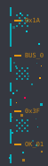
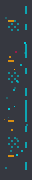

<div id="top"></div>

<div align="center">

<!-- MAIN 3D CYBERPUNK TERMINAL HEADER (Radar 360° + CRT Scanline + Equalizer) -->


<br/>

<!-- NAVIGATION PILLS -->
<a href="#suite-1-cyberpunk-terminal-workstation"></a>
<a href="#suite-2-tactical-military-hud"></a>
<a href="#suite-3-cyber-gutter-terminal"></a>
<a href="CATALOG.md"></a>
<a href="TEST_SUITE.md"></a>
<a href="#quick-start--cli-generator"></a>

<br/><br/>

<!-- ANIMATED PCB DIVIDER (Traveling Data Packet) -->


</div>

## 📌 OVERVIEW // О ПРОЕКТЕ

**Pixel Readme Kit v2.2** — модульная дизайн-система в эстетике ретро-киберпанка, тактических HUD-терминалов и полупрозрачного стекла.

Создана для оформления GitHub профилей и репозиториев без недостатков статических картинок:
-  🧊 **True Alpha Blending (Контрастность на темной и светлой темах)**: `rgba(10, 14, 23, 0.82)` гарантирует глубокую темную подложку как на черном фоне GitHub Dark (`#0d1117`), так и на белом фоне GitHub Light (`#ffffff`). Текст и границы не выгорают и сохраняют контрастность выше 7:1.
-  📋 **100% Живой Markdown-текст**: Документация, команды консоли, списки и LaTeX-формулы остаются копируемыми и индексируемыми.
-  📐 **3 Полноценных тематических сюиты**: Cyberpunk Terminal, Tactical Military HUD, Cyber Gutter Terminal.
-  💫 **Живые SVG CSS-анимации**: Вращающийся луч радара 360°, бегущая CRT-строка сканирования, прицельный лазер, бегущий пакет данных по плате, каскадный импульс лестниц и пульсирующие светодиоды.
-  📦 **100+ SVG-компонентов**: Полный визуальный справочник доступен в **[Каталоге компонентов (CATALOG.md)](CATALOG.md)**.

<br/>


> **АРХИТЕКТУРНЫЙ ПРИНЦИП**: Все элементы используют прозрачность стекла `rgba(...)` и нативные SVG-примитивы с отрисовкой `crispEdges`. Они никогда не замыливаются и одинаково безупречно выглядят на Retina-экранах и мобильных устройствах.

---

<div id="suite-1-cyberpunk-terminal-workstation"></div>

### 🟢 1. SUITE 1: CYBERPUNK TERMINAL WORKSTATION

Флагманский стиль открытого терминала. Верхний и нижний фреймы снабжены направляющими зубцами (`│` и `│`), смотрящими строго в сторону контента. Внутри продемонстрировано **горизонтальное расщепление текста** через Т-образный соединитель подмодулей:

<!-- TOP FRAME (MATRIX GREEN) -->


> #### 🧬 MODULE 01 // RUNTIME KERNEL SPEC
>
> Живой Markdown-контент находится строго по центру между направляющими зубцами:
>
> ```bash
> # Клонирование и сборка терминального комплекта
> git clone https://github.com/Kazinagg/pixel-readme-kit.git
> python generator/cli.py --theme matrix --style terminal --title "CYBER-CORE"
> ```
>
> -   ➔ **Ядро системы активно** (живой мерцающий маяк)
> -   ➔ Модуль RLE-сжатия 3D пиксельных шрифтов

<!-- SUB-BLOCK SPLITTER (TERMINAL T-JUNCTION) -->


> #### ⚡ MODULE 02 // TELEMETRY & HARDWARE BUS
>
> Второй расщепленный блок с параметрами окружения:
> -   ➔ Архитектура True Alpha Blending (`rgba(10, 14, 23, 0.82)`)
> -   ➔ Чистый Python 3.8+ без внешних библиотек

<!-- BOTTOM FRAME (MATRIX GREEN) -->


---

<div id="suite-2-tactical-military-hud"></div>

### 🟡 2. SUITE 2: TACTICAL MILITARY HUD // TRANSITIONAL SHOULDERS

Боевой интерфейс со скошенными углами 45°. Для идеального визуального сопряжения между фреймами и таблицей GitHub используются **переходные адаптеры плеч (Transitional Shoulders)**, расширяющие контур под поля таблицы и плавно замыкающие его внизу:

<!-- TOP FRAME (AMBER CHAMFER 45°) -->


<!-- TRANSITIONAL SHOULDER ADAPTER (TOP: EXPAND BUS) -->


<table border="0" cellpadding="0" cellspacing="0" width="100%">
  <tr>
    <td width="40" valign="top" align="center" style="line-height: 0; padding: 0;">
      
    </td>
    <td style="padding: 10px 24px;">

#### 🛰️ TACTICAL TELEMETRY STREAM
Внутри замкнутого бокса данные защищены боковыми шинами.


> **ПРАВИЛО РАЗМЕТКИ**: Для внешних рельсов используйте ширину ячеек `width="40"` или `width="54"`, чтобы предотвратить сплющивание картинок из-за правила GitHub table padding.

| Подсистема | Режим | Анимация | Статус |
| :--- | :--- | :--- | :--- |
| `Radar 360°` | Full Sweep | `<animateTransform>` |  |
| `Target Laser` | 4s Traverse | `@keyframes targetScan` |  |
| `Ladder Bus` | Cascade Glow | `@keyframes rungGlow` | `ACTIVE` |

    </td>
    <td width="40" valign="top" align="center" style="line-height: 0; padding: 0;">
      
    </td>
  </tr>
</table>

<!-- SUB-BLOCK SPLITTER (TACTICAL CHEVRON 45°) -->


<!-- TRANSITIONAL SHOULDER ADAPTER (BOTTOM: CONTRACT BUS) -->


<!-- BOTTOM FRAME (AMBER CHAMFER 45°) -->


<br/>

<!-- ANIMATED LASER DIVIDER -->


---

<div id="suite-3-cyber-gutter-terminal"></div>

### 🔵 3. SUITE 3: CYBER GUTTER TERMINAL // 54PX DITHER RAILS

Так как GitHub автоматически накладывает рамки на ячейки таблиц, этот режим **обыгрывает рамки как намеренную структуру интерфейса**:
- Боковые ячейки увеличены до **54px**, благодаря чему графические элементы (`gutter-left-cyberpunk.svg`) **никогда не сжимаются и не съезжают**.
- Внутри: **шахматный дизеринг ("шашкой")**, **рассеянная пиксельная пыль**, прерывистые направляющие шины данных и контрольные метки `0x...`.
- Внутри блока показано **вертикальное расщепление контента на 2 колонки**:

<!-- TOP FRAME (CYBERPUNK CYAN ENCLOSURE) -->


<table border="0" cellpadding="0" cellspacing="0" width="100%">
  <tr>
    <td width="54" align="center" valign="top" style="padding: 0;">
      
    </td>
    <td style="padding: 10px 24px;">

#### ⚡ RETRO CYBER-GUTTER // 2-COLUMN DECOMPOSITION
Границы таблицы GitHub становятся естественными разделителями между экраном и боковыми шинами:

<!-- 2-COLUMN SPLIT INSIDE TEXT -->
<table width="100%">
  <tr>
    <td width="50%" valign="top">
      <b>[ 📊 COLUMN A: TELEMETRY ]</b><br/><br/>
        ➔ <code>generator/builder.py</code><br/>
        ➔ Релиз v2.2 Dual-Theme<br/>
        ➔ 100% валидация XML
    </td>
    <td width="50%" valign="top">
      <b>[ 🛠️ COLUMN B: COMMANDS ]</b><br/><br/>
       <code>python cli.py --theme cyberpunk</code><br/>
       <code>python cli.py --theme amber</code><br/>
       <code>python cli.py --theme tokyo</code>
    </td>
  </tr>
</table>

    </td>
    <td width="54" align="center" valign="top" style="padding: 0;">
      
    </td>
  </tr>
</table>

<!-- SUB-BLOCK SPLITTER (DECAY DITHER) -->


<!-- BOTTOM FRAME (CYBERPUNK CYAN ENCLOSURE) -->


---

<div id="header-styles-gallery"></div>

### 🏛️ HEADER STYLES GALLERY // 3 ВАРИАНТА ШАПОК

В дизайн-системе сохранены все созданные варианты шапок с уникальными эффектами:

#### Вариант 1: Cyberpunk 3D Workstation (Radar 360° + CRT Scanline + Spectrum)
Флагманская рабочая станция с вращающимся лучом радара 360°, бегущей CRT-строкой сканирования, эквалайзером и 3D-шрифтом:


#### Вариант 2: Tactical Military HUD (Sweeping Laser + Hazard Stripes)
Боевой тактический интерфейс со скошенными углами 45°, бегущим лучом прицела и блокировкой цели:


#### Вариант 3: Minimal Glass & Live Equalizer
Широкий минималистичный неоновый баннер с прыгающими полосами эквалайзера и дышащей каймой:


---

### 🎨 ПАЛИТРЫ И КАЛИБРОВКА КОНТРАСТНОСТИ

Все цвета откалиброваны для одинаковой читаемости на темном (`#0D1117`) и белом (`#FFFFFF`) фонах:

| Палитра | Назначение | Основной цвет | Акцент 1 | Акцент 2 |
| :--- | :--- | :--- | :--- | :--- |
| **`cyberpunk`** | Kazinagg Core | `#00C8D7` (Electric Cyan) | `#FF0055` (Laser Pink) | `#A855F7` (Cyber Purple) |
| **`matrix`** | Emerald Terminal | `#00D26A` (Matrix Green) | `#00E5FF` (Teal Link) | `#EAB308` (Cyber Yellow) |
| **`amber`** | Retro CRT Phosphor | `#F59E0B` (CRT Amber) | `#EA580C` (CRT Orange) | `#10B981` (Retro Mint) |
| **`tokyo`** | Tokyo Vaporwave | `#4F8BFF` (Tokyo Blue) | `#A855F7` (Tokyo Violet)| `#06B6D4` (Cyan Accent) |

---

---

<div id="component-catalog"></div>

### 📚 БИБЛИОТЕКА КОМПОНЕНТОВ // COMPONENT CATALOG


> **100+ ГОТОВЫХ SVG-КОМПОНЕНТОВ**: Дизайн-система содержит более сотни калиброванных элементов: 3 стиля шапок, 4 закрывающих футера с навигацией, 16 пиксельных маркеров списков, 19 чипов, рамки окон, адаптеры 45°, боковые шины и разделители.
>
> Чтобы титульный README оставался чистым и сфокусированным, подробный визуальный справочник со всеми файлами, превью и сниппетами вынесен в отдельный документ:

<br/>

<div align="center">

<h3>🔗 <a href="CATALOG.md">👉 [ ПЕРЕЙТИ В ПОЛНЫЙ ВИЗУАЛЬНЫЙ КАТАЛОГ (CATALOG.MD) ] 👈</a></h3>

<br/>

<a href="CATALOG.md"></a>
&nbsp;
<a href="CATALOG.md#4-пиксельные-маркеры-списков-pixel-bullet-lists-1414"></a>
&nbsp;
<a href="CATALOG.md#3-инлайн-плашки-и-алерты-inline-callouts--alerts"></a>
&nbsp;
<a href="CATALOG.md#2-закрывающие-пластины-master-footers"></a>
&nbsp;
<a href="TEST_SUITE.md"></a>

</div>

---

<div id="quick-start--cli-generator"></div>

### 🚀 QUICK START & CLI GENERATOR

Сгенерировать набор под любой проект одной командой (чистый Python, без сторонних библиотек):

```bash
# 1. Сгенерировать флагманский терминал в стиле Cyberpunk
python generator/cli.py --theme cyberpunk --style terminal --title "PROJECT-X"

# 2. Сгенерировать тактический военный HUD в янтарной гамме
python generator/cli.py --theme amber --style tactical --title "SECURITY"

# 3. Сгенерировать минималистичный баннер Tokyo Night
python generator/cli.py --theme tokyo --style minimal --title "AUDIO-SYNTH"
```

#### Структура полной коллекции ассетов (`assets/`):
```
assets/
├── headers/                             # 3 флагманских титульных баннера (850px)
│   ├── header-terminal-cyberpunk.svg    # Радар 360°, scanline и эквалайзер
│   ├── header-tactical-amber.svg        # Тактический прицел и скосы 45°
│   └── header-minimal-tokyo.svg         # Неоновый градиент и эквалайзер
├── footers/                             # 4 закрывающих пластины с навигацией [▲ RETURN TO TOP]
│   ├── footer-terminal-cyberpunk.svg    # Терминальный статус и кластер
│   ├── footer-tactical-amber.svg        # Гриф секретности DEFCON 5
│   ├── footer-minimal-tokyo.svg         # Лицензия и копирайт
│   └── footer-matrix-green.svg          # Консольное завершение сессии
├── callouts/                            # 4 инлайн-плашки для заметок и алертов
│   ├── callout-note-cyan.svg            # Информационный блок [NOTE // 0x01]
│   ├── callout-warning-amber.svg        # Сигнальное предупреждение [WARNING // HAZARD]
│   ├── callout-critical-magenta.svg     # Аварийный блок с пульсирующим маяком [CRITICAL]
│   └── callout-success-green.svg        # Статус развертывания [SUCCESS // OK]
├── bullets/                             # 16 пиксельных маркеров списков (14×14px SVG)
│   ├── bullet-diamond-cyan.svg          # Неоновый ромб Cyberpunk
│   ├── bullet-arrow-pink.svg            # Лазерная стрелка
│   ├── bullet-chevron-amber.svg         # Тактический шеврон ▲
│   ├── bullet-alert-amber.svg           # Сигнал тревоги [!]
│   ├── bullet-square-green.svg          # Пиксельный квадрат ▪
│   ├── bullet-prompt-green.svg          # Терминальный промпт >>
│   └── ... (см. CATALOG.md для полного списка)
├── frames/                              # Верхние и нижние крышки окон (Brackets, Chamfer, Enclosure)
├── splitters/                           # Сплиттеры подмодулей (Terminal, Tactical, Decay)
├── adapters/                            # 45° переходные адаптеры расширения/сужения контура
├── rails/                               # Боковые шины данных 54px и анимированные лестницы 14px
└── chips/                               # 19 голографических чипов (Closed, Chamfer, Decay, Pulse)
```

<br/>

<div align="center">

<!-- MASTER FOOTER (CYBERPUNK WITH RETURN TO TOP) -->
<a href="#top"></a>

<br/><br/>

<a href="https://github.com/Kazinagg"></a>
&nbsp;&nbsp;
<a href="CATALOG.md"></a>

<br/><br/>

<sub>PIXEL README KIT v2.2 &bull; CRAFTED FOR TRANSLUCENT DUAL-THEME GITHUB PROFILES &bull; 2026</sub>

</div>
