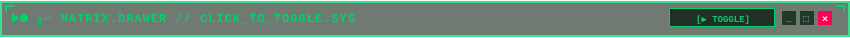

# 🧪 ЛАБОРАТОРИЯ ЭКСПЕРИМЕНТОВ // TEST SUITE (ПРИОРИТЕТ 2)

<div id="top"></div>

<div align="center">


<br/>

<a href="SHOWCASE.md"> <b>[ 🏛️ ПОЛНЫЙ SHOWCASE README ]</b></a>
&nbsp;&nbsp;
<a href="CATALOG.md"> <b>[ 📚 КАТАЛОГ 100+ АССЕТОВ ]</b></a>

<br/><br/>


</div>

> [!IMPORTANT]
> 🔬 **АКТИВЕН РЕЖИМ ЖИВОЙ КАЛИБРОВКИ НА GITHUB (TEST SUITE)**
> Данный файл временно установлен в качестве основного **`README.md`** репозитория, чтобы в реальном времени оценить поведение санитайзера GitHub, адаптивность таблиц и устранение зазоров.
> Исходный витринный ридми сохранен в **[SHOWCASE.md](SHOWCASE.md)**.

---

## 📑 Оглавление тестов

1. [Исследование ограничений GitHub Markdown & Camo Proxy](#1-исследование-ограничений-github-markdown--camo-proxy)
2. [Тест 1: Вертикальные зазоры и прямое накрытие таблиц БЕЗ прокладок](#2-тест-1-вертикальные-зазоры-и-прямое-накрытие-таблиц-без-прокладок)
3. [Тест 2: Одноячеечные окна и Интегрированный Монолит (`table_minimal`)](#3-тест-2-одноячеечные-окна-и-интегрированный-монолит-table_minimal)
   - [Вариант 2А: Чистая 1-ячеечная таблица с внешними крышками (Cyberpunk Cyan)](#вариант-2а-чистая-1-ячеечная-таблица-с-внешними-крышками)
   - [Вариант 2А-Tactical: Тактический Chamfer без прокладки прямо на таблице](#вариант-2а-tactical-тактический-chamfer-без-прокладки-прямо-на-таблице)
   - [Вариант 2Б-NEW: Интегрированный Монолит `table_minimal` (Matrix Green)](#вариант-2б-new-интегрированный-монолит-table_minimal-matrix-green)
   - [Вариант 2Б-Cyan: Интегрированный Монолит `table_minimal` (Cyberpunk Cyan)](#вариант-2б-cyan-интегрированный-монолит-table_minimal-cyberpunk-cyan)
   - [Вариант 2В: 1-ячеечная таблица со сплиттером подмодулей](#вариант-2в-1-ячеечная-таблица-со-встроенным-sub-block-сплиттером)
4. [Тест 3: Сворачиваемый терминал `<details><summary>` с SVG-кнопкой (Zero Scroll Jump)](#4-тест-3-сворачиваемый-терминал-detailssummary-с-svg-кнопкой-zero-scroll-jump)
5. [Тест 4: Нативная цитата `<blockquote>` (Pure Markdown / Zero Table)](#5-тест-4-нативная-цитата-blockquote-pure-markdown--zero-table)
6. [Итоговое резюме проверенных архитектур](#6-итоговое-резюме-проверенных-архитектур)

---

<div id="1-исследование-ограничений-github-markdown--camo-proxy"></div>

## 1. 🔍 Исследование ограничений GitHub Markdown & Camo Proxy

Что GitHub **разрешает**, что **переопределяет** и что **жестко вырезает**:

<table width="100%">
  <tr>
    <th width="28%">Подсистема</th>
    <th width="36%">Поведение GitHub</th>
    <th width="36%">Последствие для дизайн-системы</th>
  </tr>
  <tr>
    <td><b>Атрибут <code>style="..."</code></b></td>
    <td>
       <b>100% вырезается</b> санитайзером на любых HTML-тегах (<code>&lt;td&gt;</code>, <code>&lt;div&gt;</code>, <code>&lt;p&gt;</code>).
    </td>
    <td>
      Нельзя задать inline CSS: <code>padding: 0</code>, <code>border: none</code>, <code>margin: 0</code>, <code>line-height: 0</code>. Нужно опираться только на нативный CSS GitHub.
    </td>
  </tr>
  <tr>
    <td><b>Рамки таблиц (<code>table, td</code>)</b></td>
    <td>
      GitHub принудительно накладывает:<br/>
      <code>td { padding: 6px 13px; border: 1px solid var(--borderColor-default); }</code>
    </td>
    <td>
      Нельзя убрать серую рамку ячеек таблицы через HTML. Если используем таблицу — рамка <b>всегда будет видна</b>. Наша стратегия: обыграть эту рамку как фичу!
    </td>
  </tr>
  <tr>
    <td><b>Боковые рельсы в 3-колоночных таблицах</b></td>
    <td>
       <b>ИДЕЯ ОТКЛОНЕНА</b>: SVG-картинки фиксированной высоты не могут растягиваться под непредсказуемый объем текста и сжимаются санитайзером.
    </td>
    <td>
      3-колоночные таблицы с рельсами исключены. Фокус смещен на накрывающие крышки (2А) и монолитную таблицу (2Б).
    </td>
  </tr>
  <tr>
    <td><b>Прямой тег <code>&lt;svg&gt;</code></b></td>
    <td>
       <b>100% вырезается</b> из Markdown.
    </td>
    <td>
      Любой SVG должен вставляться через <code>&lt;img src="path.svg" /&gt;</code>.
    </td>
  </tr>
  <tr>
    <td><b>GitHub Camo Proxy</b></td>
    <td>
      Вырезает <code>&lt;script&gt;</code>, <code>&lt;foreignObject&gt;</code>, внешние шрифты.<br/>
       <b>Разрешает</b>: <code>@keyframes</code>, SMIL <code>&lt;animate&gt;</code>, <code>&lt;animateTransform&gt;</code>, <code>@media (prefers-color-scheme)</code>.
    </td>
    <td>
      Все анимации (радар, сканеры, маяки) работают идеально внутри SVG, если XML 100% валиден (амперсанды экранированы как <code>&amp;amp;</code>).
    </td>
  </tr>
</table>

---

<div id="2-тест-1-вертикальные-зазоры-и-прямое-накрытие-таблиц-без-прокладок"></div>

## 2. ⚡ Тест 1: Вертикальные зазоры и прямое накрытие таблиц БЕЗ прокладок

### 1. Устранение переходных прокладок («прокладки больше не нужны!»):
Ранее фреймы имели пустые поля `4..6px` по бокам, из-за чего требовался переходный адаптер-плечо (`transition-shoulder`).
Теперь зубцы и внешний контур выведены на **`x=1` слева и `x=849` (`width-1`) справа**. Прокладка **полностью исключена**: фрейм стыкуется с таблицей напрямую!

### 2. Сравнение способов стыковки шапки с таблицей:

#### Способ 1А: Стандартный перенос строки (Есть щель ~4px из-за DOM Whitespace)
```html

<table width="100%"><tr><td>Текст</td></tr></table>
```
**Рендеринг 1А**:

<table width="100%"><tr><td>Демонстрация стандартного переноса: браузер добавляет щель в несколько пикселей над таблицей.</td></tr></table>

<br/>

#### Способ 1Б: Склеивание через HTML-комментарий `<!-- -->` (Код читаем + зазор 0px)
```html
<!--
--><table width="100%"><tr><td>Текст</td></tr></table>
```
**Рендеринг 1Б**:
<!--
--><table width="100%"><tr><td>Демонстрация склеивания через комментарий: нулевой зазор, идеальная посадка зубцов на верхнюю кромку таблицы.</td></tr></table>

---

<div id="3-тест-2-одноячеечные-окна-и-интегрированный-монолит-table_minimal"></div>

## 3. 🧱 Тест 2: Одноячеечные окна и Интегрированный Монолит (`table_minimal`)

### Вариант 2А: Чистая 1-ячеечная таблица с внешними крышками
- Верхняя крышка накрывает таблицу сверху.
- Нативная рамка ячейки GitHub (`border: 1px solid var(--borderColor-default)`) образует аккуратный бокс контента.
- Нижняя крышка замыкает бокс снизу.


<table width="100%">
<tr>
<td>

#### 🧬 МОДУЛЬ: ОДНОЯЧЕЕЧНЫЙ ТЕРМИНАЛ (ВАРИАНТ 2А)
-  **100% нативная адаптивность**: на смартфонах таблица сжимается идеально, текст автоматически переносится.
-  **Нет боковых рельсов**: нулевой риск сплющивания картинок, ширина всегда 100%.
-  **Встроенный padding**: GitHub автоматически дает `padding: 6px 13px`.

```bash
# Пример терминальной команды внутри одиночной ячейки
python generator/cli.py --theme cyberpunk --style terminal
```

</td>
</tr>
</table>


<br/>

### Вариант 2А-Tactical: Тактический Chamfer БЕЗ прокладки прямо на таблице
Здесь тактический фрейм садится прямо на таблицу — обратите внимание на левый и правый угол: направляющие зубцы теперь идеально совпадают с шириной таблицы:


<table width="100%">
<tr>
<td>

#### ⚡ ТАКТИЧЕСКИЙ ОДНОЯЧЕЕЧНЫЙ БОКС (БЕЗ ПРОКЛАДКИ)
-  Боковые поля в SVG полностью отсутствуют.
-  Концы зубцов фрейма (`x=1`, `x=849`) точно позиционируются над гранями ячейки таблицы.
-  Никаких промежуточных адаптеров-прокладок не требуется.

</td>
</tr>
</table>


<br/>

### Вариант 2Б-NEW: Интегрированный Монолит `table_minimal` (Matrix Green)
🎯 **Решение проблемы «границы в границах»**:
1. В SVG **полностью убран внешний замкнутый прямоугольник**.
2. В углах расположены технологические маркеры `┌` и `┐`, которые обнимают внутренние углы ячейки.
3. **Нативная рамка таблицы GitHub становится внешним корпусом окна**.
4. Внутренняя разделительная линия строк таблицы GitHub работает как технологический шов под приборной панелью.

<table width="100%">
<tr>
<td align="center">

</td>
</tr>
<tr>
<td>

#### 🟢 ИНТЕГРИРОВАННЫЙ МОНОЛИТ // ZERO DOUBLE BORDERS
-  **Внешний корпус**: нативная 1px серая рамка таблицы GitHub (в темной теме `#30363d`, в светлой `#d0d7de`).
-  **Приборная панель (Строка 1)**: встроенная в строку шапка с LED-индикатором, статусом `[TABLE_HUD]` и оконными кнопками `_ □ ×`.
-  **Шов**: 1px разделитель между `<tr>` служит линией отсечки шапки от рабочего поля.
-  **Нижний поддон (Строка 3)**: статусная планка буфера телеметрии с угловыми зацепами `└` и `┘`.

</td>
</tr>
<tr>
<td align="center">

</td>
</tr>
</table>

<br/>

### Вариант 2Б-Cyan: Интегрированный Монолит `table_minimal` (Cyberpunk Cyan)

<table width="100%">
<tr>
<td align="center">

</td>
</tr>
<tr>
<td>

#### 🔷 КИБЕРПАНК МОНОЛИТ // CYBER_TABLE
-  Идеальная чистота линий: ноль дублирования границ.
-  Автоматически реагирует на светлую/темную тему GitHub.
-  Содержимое поддерживает списки, таблицы, формулы и бейджи без конфликтов.

```json
{
  "module": "CYBER_MONOLITH",
  "borders": "NATIVE_TABLE_LEVERAGED",
  "double_borders": false,
  "status": "OPTIMAL"
}
```

</td>
</tr>
<tr>
<td align="center">

</td>
</tr>
</table>

<br/>

### Вариант 2В: 1-ячеечная таблица со встроенным Sub-Block сплиттером
Внутри одной ячейки размещен живой текст, расщепленный посередине T-образным сплиттером:

<table width="100%">
<tr>
<td>

#### 📁 СЕКЦИЯ 01 // ПЕРВИЧНЫЙ ПАКЕТ
Живой текст вводной части модуля. Поддерживает списки, формулы и бейджи:
-  Ядро дизайн-системы


#### ⚙️ СЕКЦИЯ 02 // ВТОРИЧНЫЙ ПАКЕТ
Второй подмодуль, продолжающийся внутри той же самой рамки окна:
-  Валидация XML пройдена

</td>
</tr>
</table>

---

<div id="4-тест-3-сворачиваемый-терминал-detailssummary-с-svg-кнопкой-zero-scroll-jump"></div>

## 4. 📐 Тест 3: Сворачиваемый терминал `<details><summary>` с SVG-кнопкой (Zero Scroll Jump)

> **Вопрос**: *Можно ли сделать так, чтобы SVG-шапка сама являлась кнопкой сворачивания/разворачивания, и при клике на неё экран НЕ перекидывало по якорю?*
>
> **Ответ**: **ДА!** В HTML5 тег `<summary>` нативно является интерактивным триггером аккордеона. Если поместить SVG напрямую внутрь `<summary>` (БЕЗ тега `<a href="...">`), клик по шапке переключает состояние терминала **строго на месте, без скролла, без якоря в адресной строке и без скачков страницы**.

**Попробуйте кликнуть по шапке ниже:**

<details open>
<summary></summary>

<table width="100%">
<tr>
<td>

#### 🔴 ИНТЕРАКТИВНЫЙ РАСКРЫВАЮЩИЙСЯ ТЕРМИНАЛ
-  **SVG как нативная кнопка**: клик в любую область шапки раскрывает или скрывает блок.
-  **Ноль прыжков скролла**: браузер не меняет URL-хэш (`#`), страница не дергается.
-  **Идеально для тяжелого контента**: длинные логи, подробные таблицы параметров, тесты.

```bash
# Команда синхронизации интерактивного терминала
python generator/cli.py --theme cyberpunk --interactive
```

</td>
</tr>
</table>


</details>

<br/>

#### Версия в стиле Matrix Green:
<details>
<summary></summary>

<table width="100%">
<tr>
<td>

#### 🟢 MATRIX COLLAPSIBLE DRAWER (ПО УМОЛЧАНИЮ СВЕРНУТ)
Этот блок был изначально свернут. При клике на шапку он мягко развернулся на месте.

-  Чистый пиксельный стиль
-  Полная поддержка списков и кода внутри

</td>
</tr>
</table>


</details>

---

<div id="5-тест-4-нативная-цитата-blockquote-pure-markdown--zero-table"></div>

## 5. 📜 Тест 4: Нативная цитата `<blockquote>` (Pure Markdown / Zero Table)

> **Идея**: Полный отказ от таблиц. Используется нативная левая акцентная линия GitHub (`border-left: 0.25em solid`). Внутрь помещаются рамки, сплиттеры и чипы.

> 
>
> #### 🧬 АРХИТЕКТУРА НА ТАКТОВОЙ ЦИТАТЕ GITHUB
> **Преимущества**:
> -  **Абсолютная адаптивность**: на смартфонах цитаты выглядят превосходно.
> -  **Нулевой риск проблем с таблицами**: нет padding-ограничений GitHub.
> -  **Внутреннее расщепление**:
>
> 
>
> Подмодуль продолжается внутри цитаты с сохранением цветной вертикальной шины слева.

---

<div id="6-итоговое-резюме-проверенных-архитектур"></div>

## 6. 🎯 Итоговое резюме проверенных архитектур

По итогам тестов на реальном рендерере GitHub зафиксированы следующие архитектурные решения:

| Архитектура | Статус | Как реализовано | Для чего подходит |
| :--- | :---: | :--- | :--- |
| **1. Прямое накрытие (Вариант 2А)** | ✅ **ПРИНЯТО** | Крышки `x=1..849` садятся прямо на 1-ячеечную таблицу. Прокладки полностью убраны. | Карточки продуктов, модули с акцентными шапками. |
| **2. Интегрированный Монолит (`table_minimal`)** | ✅ **ПРИНЯТО** | 3-строчная таблица, в SVG убран замкнутый бокс, нативная серая рамка GitHub служит корпусом. Ноль двойных границ. | Основные логические блоки документации, спецификации. |
| **3. Интерактивный Терминал (`<details><summary>`)** | ✅ **ПРИНЯТО** | SVG вставлен прямо в `<summary>` как кнопка. Открывается на месте без перехода по якорю. | Длинные логи, подробные таблицы параметров, скрытые разделы. |
| **4. Цитата `<blockquote>`** | ✅ **ПРИНЯТО** | Без таблиц, левая вертикальная шина `border-left`, внутри чипы и сплиттеры. | Предупреждения, важные замечания, краткие памятки. |
| **5. 3-колоночная таблица с рельсами** | ❌ **ОТКЛОНЕНО** | Фиксированная высота картинок не адаптируется под динамический текст и сплющивается GitHub. | *Идея исключена из дизайн-системы.* |

---

<div align="center">

<a href="#top"></a>

<br/><br/>

<a href="SHOWCASE.md"> <b>[ ⬅️ ПЕРЕЙТИ В ПОЛНЫЙ SHOWCASE README ]</b></a>

<br/><br/>

<sub>PIXEL README KIT v2.2 &bull; RESEARCH LAB &bull; 2026</sub>

</div>
