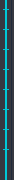
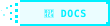
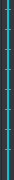
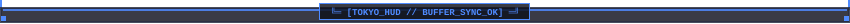

<div align="center">

<!-- MAIN 3D CYBERPUNK TERMINAL HEADER (Radar Sweep + Scanline) -->


<br/>

<!-- NAVIGATION PILLS -->
<a href="#mode-a-open-cyber-brackets-green"></a>
<a href="#mode-b-tactical-amber-box"></a>
<a href="#mode-c-minimal-tokyo-guide-lines"></a>
<a href="#header-styles-gallery"></a>
<a href="#quick-start--cli-generator"></a>

<br/><br/>

<!-- ANIMATED PCB DIVIDER (Traveling Data Packet) -->


</div>

## 📌 OVERVIEW // О ПРОЕКТЕ

**Pixel Readme Kit v2.0** — модульная дизайн-система в эстетике ретро-киберпанка, тактических HUD-терминалов и полупрозрачного стекла. 

Создана для оформления GitHub профилей и репозиториев без недостатков статических картинок:
- 🧊 **True Alpha Blending (Контрастность на темной и светлой темах)**: `rgba(10, 14, 23, 0.82)` обеспечивает глубокую затемненную подложку как на черном фоне GitHub Dark (`#0d1117`), так и на чистом белом фоне GitHub Light (`#ffffff`). Текст и границы не выгорают и сохраняют высокую читаемость.
- 📋 **100% Живой Markdown-текст**: Документация, команды консоли, списки и LaTeX-формулы остаются копируемыми и индексируемыми.
- 📐 **3 Стиля обрамления**:
  1. *Mode A (Open Cyber Brackets)* — открытые скобы с направляющими зубцами, открывающимися строго вниз.
  2. *Mode B (Tactical Full Box)* — тактические скосы 45° с вертикальными рельсами-лестницами.
  3. *Mode C (Minimal Guide Lines)* — тонкие боковые неоновые направляющие 1px для легкого обрамления.
- 💫 **Живые SVG CSS-анимации**: Вращающийся луч радара, сканирующие лазерные лучи, бегущие пакеты данных по печатной плате, каскадный импульс по боковым шинам и пульсирующие светодиоды.
- 💎 **5 типов голографических чипов**: Closed, 45° Chamfer, Decay-Right (растворение в текст), Decay-Left (выход из текста), Pulse (с живым маяком).

---

<div id="mode-a-open-cyber-brackets-green"></div>

### 🟢 1. MODE A: OPEN CYBER BRACKETS // MATRIX THEME

Верхний и нижний фреймы снабжены вертикальными направляющими зубцами (`│` и `│`), которые **смотрят строго вниз и вверх**, открывая окно в живой контент. Текст обернут с боковыми отступами, благодаря чему он **никогда не выходит за габариты уголков**:

<!-- TOP FRAME (MATRIX GREEN) -->


<table border="0" cellpadding="0" cellspacing="0" width="100%">
  <tr>
    <td width="24">&nbsp;</td>
    <td>

#### 🧬 SYSTEM ARCHITECTURE // RUNTIME KERNEL
Живой Markdown-контент находится строго в границах терминала:

```bash
# Генерация набора в зеленой теме Matrix
python generator/cli.py --theme matrix --style terminal --title "MATRIX-CORE"
```

-  ➔ **Ядро системы активно** (живой мерцающий маяк)
-  ➔ Модуль RLE-сжатия 3D пиксельных шрифтов
-  ➔ Чистый Python 3.8+ без внешних зависимостей

    </td>
    <td width="24">&nbsp;</td>
  </tr>
</table>

<!-- BOTTOM FRAME (MATRIX GREEN) -->


---

<div id="mode-b-tactical-amber-box"></div>

### 🟡 2. MODE B: TACTICAL CHAMFER & FULL ENCLOSURE // AMBER CRT THEME

Для изолированных экранов используется полный замкнутый контур: верхняя и нижняя панели со скошенными углами 45° соединяются боковыми шинами данных (`rail-left-ladder-amber.svg` и `rail-right-ladder-amber.svg`) с **каскадной бегущей анимацией световых импульсов**:

<!-- TOP FRAME (AMBER CHAMFER 45°) -->


<table border="0" cellpadding="0" cellspacing="0" width="100%">
  <tr>
    <td width="14" valign="top" align="left" style="line-height: 0; padding: 0;">
      
    </td>
    <td style="padding: 10px 24px;">

#### 🛰️ TACTICAL TELEMETRY STREAM
Внутри замкнутого бокса данные защищены боковыми направляющими. Здесь идеально размещать таблицы параметров и статусов:

| Подсистема | Режим | Анимация | Статус |
| :--- | :--- | :--- | :--- |
| `Radar Monitor` | 360° Sweep | `@keyframes radarSweep` |  |
| `Laser Scanner` | 4s Traverse | `@keyframes targetScan` |  |
| `Ladder Bus` | Cascade Glow | `@keyframes rungGlow` | `ACTIVE` |

    </td>
    <td width="14" valign="top" align="right" style="line-height: 0; padding: 0;">
      
    </td>
  </tr>
</table>

<!-- BOTTOM FRAME (AMBER CHAMFER 45°) -->


<br/>

<!-- ANIMATED LASER DIVIDER -->


---

<div id="mode-c-minimal-tokyo-guide-lines"></div>

### 🟣 3. MODE C: MINIMAL NEON RAIL & SIDE GUIDE LINES // TOKYO THEME

Режим с **тонкими неоновыми линиями по бокам** (как запрошено для аккуратного очерчивания текста) и демонстрацией эффекта **растворения пикселей (Decay Chips)**:

<!-- TOP FRAME (TOKYO NIGHT) -->


<table border="0" cellpadding="0" cellspacing="0" width="100%">
  <tr>
    <td width="14" valign="top" align="left" style="line-height: 0; padding: 0;">
      
    </td>
    <td style="padding: 10px 24px;">

#### 💫 DISSOLVING PIXEL DECAY (ПЕРЕТЕКАНИЕ В ТЕКСТ)
Голографические чипы могут плавно переходить в следующий текст через рассеянный дизеринг пикселей:

-  ➔ `src/generator/builder.py` — генератор SVG-компонентов
-  ➔ Релиз v2.0 с поддержкой всех тем и контраста
-  ➔ Полная совместимость со светлой и темной темами
- Документация по установке и настройке ➔ 

    </td>
    <td width="14" valign="top" align="right" style="line-height: 0; padding: 0;">
      
    </td>
  </tr>
</table>

<!-- BOTTOM FRAME (TOKYO NIGHT) -->


---

<div id="header-styles-gallery"></div>

### 🏛️ HEADER STYLES GALLERY // 3 ВАРИАНТА ШАПОК

В дизайн-систему включены 3 принципиально разных типа шапок с индивидуальными анимациями:

#### Вариант 1: Cyberpunk 3D Workstation (Scanline + Radar Sweep)
Полная рабочая станция с вращающимся радаром 360°, терминальным вводом `> _`, бегущей CRT-линией сканирования и 3D-шрифтом:


#### Вариант 2: Tactical Military HUD (Sweeping Laser + Hazard Stripes)
Боевой тактический интерфейс со скошенными углами 45°, бегущим лучом прицела и блокировкой цели:


#### Вариант 3: Minimal Glass & Live Equalizer
Широкий минималистичный неоновый баннер с прыгающими полосами эквалайзера и дышащей каймой:


---

### 🎨 ПАЛИТРЫ И КАЛИБРОВКА КОНТРАСТНОСТИ

Все цвета откалиброваны для одинаковой читаемости на темном (`#0D1117`) и белом (`#FFFFFF`) фонах:

| Палитра | Назначение | Основной цвет | Акцент 1 | Акцент 2 |
| :--- | :--- | :--- | :--- | :--- |
| **`cyberpunk`** | Kazinagg Core | `#00C8D7` (Electric Cyan) | `#FF0055` (Laser Pink) | `#A855F7` (Cyber Purple) |
| **`matrix`** | Emerald Terminal | `#00D26A` (Matrix Green) | `#00E5FF` (Teal Link) | `#EAB308` (Cyber Yellow) |
| **`amber`** | Retro CRT Phosphor | `#F59E0B` (CRT Amber) | `#EA580C` (CRT Orange) | `#10B981` (Retro Mint) |
| **`tokyo`** | Tokyo Vaporwave | `#4F8BFF` (Tokyo Blue) | `#A855F7` (Tokyo Violet)| `#06B6D4` (Cyan Accent) |

---

<div id="quick-start--cli-generator"></div>

### 🚀 QUICK START & CLI GENERATOR

Сгенерировать набор под любой проект одной командой (чистый Python, без сторонних библиотек):

```bash
# 1. Сгенерировать флагманский терминал в стиле Cyberpunk
python generator/cli.py --theme cyberpunk --style terminal --title "PROJECT-X"

# 2. Сгенерировать тактический военный HUD в янтарной гамме
python generator/cli.py --theme amber --style tactical --title "SECURITY"

# 3. Сгенерировать минималистичный баннер Tokyo Night
python generator/cli.py --theme tokyo --style minimal --title "AUDIO-SYNTH"
```

#### Структура директории `assets/`:
```
assets/
├── headers/
│   ├── header-terminal-cyberpunk.svg    # 3D терминал с радаром и сканирующим лучом
│   ├── header-tactical-amber.svg        # Тактический 45° HUD с прицелом
│   └── header-minimal-tokyo.svg         # Минималистичный баннер с эквалайзером
├── frames/
│   ├── frame-top-brackets-green.svg     # Скобы с открывающимися вниз зубцами (Mode A)
│   ├── frame-bottom-brackets-green.svg  # Скобы с подхватывающими зубцами вверх
│   ├── frame-top-chamfer-amber.svg      # Тактический скос 45° (Mode B)
│   └── frame-bottom-chamfer-amber.svg   # Тактический поддон 45°
├── rails/
│   ├── rail-left-ladder-amber.svg       # Анимированная шина-лестница
│   ├── rail-left-laser-cyan.svg         # Тонкая неоновая линия 1px для боков
│   └── rail-left-matrix-green.svg       # Матричный поток точек
└── chips/
    ├── chip-closed-*.svg                # Замкнутые капсулы
    ├── chip-chamfer-*.svg               # 45° тактические бейджи
    ├── chip-decay-right-*.svg           # Растворение пикселей вправо
    ├── chip-decay-left-*.svg            # Выход пикселей влево
    └── chip-pulse-*.svg                 # Чипы с живым мерцающим маяком
```

<br/>

<div align="center">

<a href="https://github.com/Kazinagg"></a>

<br/><br/>

<sub>PIXEL README KIT v2.0 &bull; CRAFTED FOR TRANSLUCENT DUAL-THEME GITHUB PROFILES &bull; 2026</sub>

</div>
