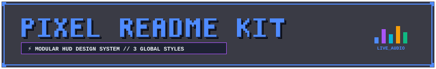
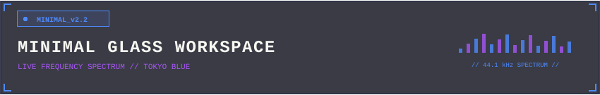
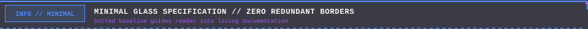
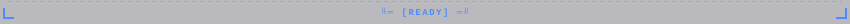
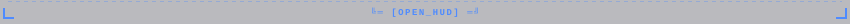
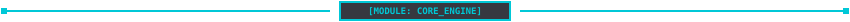
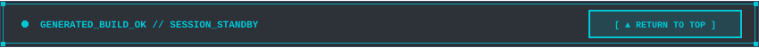

# 📦 PIXEL README KIT — ГЕНЕРИРУЕМЫЙ КАТАЛОГ (3 ГЛОБАЛЬНЫХ СТИЛЯ)

<div id="top"></div>

<div align="center">



<br/><br/>


&nbsp;&nbsp;


<br/><br/>


</div>

> [!IMPORTANT]
> 📐 **ФУНДАМЕНТАЛЬНЫЙ ПРИНЦИП ДИЗАЙН-СИСТЕМЫ**:
> 1. **Стиль (Форма и Геометрия)**: существует ровно **3 канонических стиля** — **Cyberpunk**, **Tactical Military** и **Minimal Glass**.
> 2. **Цветовая палитра (`primary` + `accent`)**: полностью независима от формы. В каталоге стили демонстрируются в канонических цветах:
>    - 🟢 **Cyberpunk** ➔ Neon Cyan (`#00C8D7`) / Purple (`#A855F7`)
>    - 🟡 **Tactical Military** ➔ Amber Phoshor (`#F59E0B`) / Alert Orange (`#EA580C`)
>    - 🟣 **Minimal Glass** ➔ Tokyo Neon Blue (`#4F8BFF`) / Magenta (`#A855F7`)

---

## 1. 🏛️ Заглавные шапки (Master Headers — 3 стиля)

### 1.1 Cyberpunk 3D Workstation (Радар 360° + CRT Scanline)


<br/>

### 1.2 Tactical Military HUD (Прицельный лазер + Скосы 45°)


<br/>

### 1.3 Minimal Glass & Live Equalizer


---

## 2. 🏁 Закрывающие пластины (Master Footers — 3 стиля во всю ширину)

### 2.1 Cyberpunk Terminal Footer
<a href="#top"></a>

<br/>

### 2.2 Tactical Military Footer
<a href="#top"></a>

<br/>

### 2.3 Minimal Glass Footer
<a href="#top"></a>

---

## 3. 💬 Инлайн-плашки и алерты (Callouts)

### 3.1 Автономные закрытые плашки


<br/>


<br/>



<br/>

### 3.2 Подкласс: Плашки для цитат `> ` (Открытый левый край + пунктирный низ)

> 
>
> **Живой текст внутри цитаты**: плашка бесшовно открыта слева к серой полосе цитаты GitHub (`border-left`), а нижняя пунктирная линия мягко направляет внимание на текстовое содержимое ниже.

<br/>

> 
>
> **Критическое предупреждение**: тактическая сигнальная линия открыта слева и направляет поток внимания на важные эксплуатационные ограничения ниже.

<br/>

> 
>
> **Минималистичная справка**: тонкая стеклянная направляющая с точечным пунктиром, плавно перетекающим в текст документации.

---

## 4. 🪟 Рамки окон (Window Frames — 3 стиля без прокладок)

### 4.1 Cyberpunk Brackets (Cyan)


<table width="100%">
<tr>
<td width="100%">

#### 🧬 CYBERPUNK WINDOW // DIRECT TABLE CAPPING
Зубцы верхней и нижней крышек на `x=1` и `x=849` садятся прямо на внешние 1px серые грани таблицы.

</td>
</tr>
</table>


<br/>

### 4.2 Tactical Chamfer 45° (Amber)


<table width="100%">
<tr>
<td width="100%">

#### ⚡ TACTICAL WINDOW // ZERO SHOULDER ADAPTERS
Фаски на `x=1` и `x=849` точно совпадают с гранями таблицы. Прокладки полностью устранены.

</td>
</tr>
</table>


<br/>

### 4.3 Minimal Glass Monolith (Tokyo Blue)
<table width="100%">
<tr>
<td width="100%" align="center">

</td>
</tr>
<tr>
<td width="100%">

#### 🟣 MINIMAL GLASS // TOKYO MONOLITH
- Внешняя рамка: нативная 1px серая рамка таблицы GitHub.
- Разделитель строк: технологический шов под шапкой.
- Угловые зацепы `┌ ┐` и `└ ┘` внутри SVG обнимают внутренние углы ячеек.

</td>
</tr>
<tr>
<td width="100%" align="center">

</td>
</tr>
</table>

---

## 5. 📱 Интерактивный терминал `<details><summary>`

### 5.1 Пример 1: Открыт по умолчанию (Cyberpunk)
<details open>
<summary><kbd>▶ HUD.TERMINAL</kbd> <b>[ НАЖМИТЕ ДЛЯ СВОРАЧИВАНИЯ / РАЗВОРАЧИВАНИЯ ]</b> <code>[STATE: EXPANDED]</code></summary>

<br/>


<table width="100%">
<tr>
<td width="100%">

#### 🔴 ИНТЕРАКТИВНЫЙ ТЕРМИНАЛ // СОДЕРЖИМОЕ
- Раскрывается и скрывается в один клик без перезагрузки и без скролла страницы.

```bash
# Пример команды терминала
git clone https://github.com/Kazinagg/pixel-readme-kit.git
```

</td>
</tr>
</table>


</details>

<br/>

### 5.2 Пример 2: Свернут по умолчанию (Minimal Glass)
<details >
<summary><kbd>▶ SYSTEM.LOGS</kbd> <b>[ НАЖМИТЕ ДЛЯ СВОРАЧИВАНИЯ / РАЗВОРАЧИВАНИЯ ]</b> <code>[CLICK TO EXPAND]</code></summary>

<br/>


<table width="100%">
<tr>
<td width="100%">

```text
[2026-09-26 15:30:00] [SYSTEM] Initializing Pixel Readme Kit engine...
[2026-09-26 15:30:01] [GRAPHICS] Loading 3 global styles: Cyberpunk, Tactical, Minimal Glass.
[2026-09-26 15:30:02] [DRAWER] Interactive drawer toggled successfully with 0ms delay.
[2026-09-26 15:30:03] [STATUS] All systems operational [100% PASS].
```

</td>
</tr>
</table>



</details>

---

## 6. ⚡ Разделители глав и сплиттеры (Dividers & Splitters — 3 стиля)

### 6.1 Глобальные разделители

#### 1. Cyberpunk PCB Divider (Печатная плата с бегущим пакетом)


<br/>

#### 2. Tactical Laser Divider (Пульсирующий прицельный лазер)


<br/>

#### 3. Minimal Glass Frequency Spectrum Divider (Частотный эквалайзер)


---

### 6.2 Внутренние сплиттеры подмодулей (Flush x=1..849)

#### 1. Terminal T-Junction Splitter (Cyberpunk)


<br/>

#### 2. Tactical Chevron Splitter (Tactical Military)


<br/>

#### 3. Minimal Decay Dither Splitter (Minimal Glass)


---

## 7. 💎 Голографические чипы и бейджи (Chips & Pills — 3 стиля формы и распада)

| Элемент / Характеристика | 🟢 Cyberpunk Terminal | 🟡 Tactical Military HUD | 🟣 Minimal Glass |
| :--- | :--- | :--- | :--- |
| **Геометрия формы** | Прямые углы, пиксельные замки `3×3`, открытые скобы | 45° срезанные фаски (Chamfers), октагон, шевроны `▲` | Волосяная рамка 1px (Hairline), угловые зацепы `┌ ┐` и `└ ┘` |
| **Физика распада (Decay)** | **Матричный пиксельный дизеринг**: блоки пикселей `3×3`, `2×2`, `1×1` отлетают как цифровой глитч | **Диагональные полосы фасок `///`**: 45° наклонные зубчатые сегменты, убывающие по высоте и alpha | **Микроточечное рассеивание**: матрица микро-stipple точек 1px и тающая пунктирная шина стекла |
| **1. Замкнутый блок** |  |  |  |
| **2. Блок с распадом** |  |  |  |
| **3. Живой статус / Маяк** |  |  |  |

---

<div align="center">

<a href="#top"></a>

<br/><br/>

<sub>PIXEL README KIT v2.2 &bull; COMPILED BY MARKDOWN GENERATOR &bull; 2026</sub>

</div>
