# 🌓 Лаборатория тестирования тем GitHub и прозрачности SVG

[◀ Вернуться к главному README](README.md) &nbsp;|&nbsp; [📚 Каталог блоков](CATALOG.md) &nbsp;|&nbsp; [💡 Примеры](EXAMPLES.md)

---

В этом документе представлены **4 практических теста** адаптации SVG-графики под светлую и тёмную темы GitHub, а также тест шапки с **полностью прозрачным фоном**.

> [!TIP]
> **Как тестировать прямо сейчас на GitHub**:
> 1. Откройте эту страницу в репозитории на GitHub.
> 2. Перейдите в **GitHub Settings** ➔ **Appearance** ➔ **Theme preferences** (или кликните на аватар ➔ **Theme**).
> 3. Переключайте между **Dark default / Dark dimmed** и **Light default**, либо меняйте тему в вашей ОС (Windows / macOS).

---

## 🧪 Тест 1. Официальный синтаксис GitHub (`#gh-dark-mode-only` и `#gh-light-mode-only`)

Этот способ использует официальный функционал рендерера GitHub Markdown. GitHub анализирует хэш в URL изображения и скрывает/показывает нужный SVG на основе активной темы профиля GitHub (`[data-color-mode]`).

### Живой результат на GitHub:


### Исходный Markdown код:
```markdown


```

- **В тёмной теме GitHub**: отображается неоновый бирюзово-фиолетовый `header-gh-dark.svg`.
- **В светлой теме GitHub**: отображается контрастный сине-фиолетовый `header-gh-light.svg`.
- **Особенность**: Работает строго по селектору темы **самого GitHub**, даже если тема ОС не совпадает с темой на сайте.

---

## 🧪 Тест 2. HTML5-тег `<picture>` с `prefers-color-scheme`

Используется стандартный браузерный тег `<picture>`, разрешенный в GitHub Markdown.

### Живой результат на GitHub:

<picture>
  <source media="(prefers-color-scheme: dark)" srcset="assets/theme-tests/header-pic-dark.svg">
  <source media="(prefers-color-scheme: light)" srcset="assets/theme-tests/header-pic-light.svg">
  
</picture>

### Исходный HTML код:
```html
<picture>
  <source media="(prefers-color-scheme: dark)" srcset="assets/theme-tests/header-pic-dark.svg">
  <source media="(prefers-color-scheme: light)" srcset="assets/theme-tests/header-pic-light.svg">
  
</picture>
```

- **В тёмной системной теме**: загружается тактический янтарный HUD `header-pic-dark.svg`.
- **В светлой системной теме**: загружается тёплый охристый HUD `header-pic-light.svg`.
- **Особенность**: Реагирует на настройки **операционной системы / браузера**, а не на внутренний переключатель темы GitHub.

---

## 🧪 Тест 3. Один SVG с адаптивным CSS `@media (prefers-color-scheme: dark)`

В этом тесте используется **всего один SVG файл** (`header-adaptive-internal.svg`). Внутри файла объявлены CSS-переменные `:root` и медиа-запрос `@media (prefers-color-scheme: dark)`.

### Живой результат на GitHub:


### Исходный Markdown код:
```markdown

```

### Как устроен этот SVG внутри:
```xml
<svg xmlns="http://www.w3.org/2000/svg" viewBox="0 0 850 260" width="100%">
  <style>
    :root {
      --bg-glass: #F6F8FA;
      --primary: #0969DA;
      --accent: #8250DF;
      --text-main: #1F2328;
    }
    @media (prefers-color-scheme: dark) {
      :root {
        --bg-glass: rgba(10, 14, 23, 0.85);
        --primary: #00C8D7;
        --accent: #A855F7;
        --text-main: #F8F8F2;
      }
    }
    .frame { fill: var(--bg-glass); stroke: var(--primary); }
    .text { fill: var(--text-main); }
  </style>
  <rect class="frame" width="850" height="260" />
  <text class="text" x="40" y="80">ADAPTIVE HUD</text>
</svg>
```

- **Плюсы**: В репозитории хранится только **один файл** (нет дубликатов для светлой и тёмной темы).
- **Особенность**: Реагирует на системную тему ОС. Браузер перекрашивает SVG динамически на лету.

---

## 🧪 Тест 4. Шапка с полностью прозрачным фоном (Zero Fill / 100% Alpha)

В стандартном генераторе `pixel-readme-kit` все шапки и окна имеют подложку `rgba(10, 14, 23, 0.85)` (**True Alpha Blending**). В этом тесте подложка полностью удалена (`fill="none"` / отсутствие прямоугольника подложки).

### Живой результат на GitHub:



### Исходный Markdown код:
```markdown

```

### Что происходит при смене темы:
1. **На тёмной теме GitHub (`#0d1117`)**:
   Неоновые контуры Cyan (`#00C8D7`) и Purple (`#A855F7`), сетка и радар «парят» прямо над родным фоном страницы репозитория GitHub. Выглядит как чистая голограмма.
2. **На светлой теме GitHub (`#ffffff`)**:
   Фон страницы становится чисто белым. Обратите внимание: светлые неоновые цвета (Cyan, желтые индикаторы, белый текст) теряют контрастность относительно белого листа. Именно поэтому в комплекте по умолчанию используется темная подложка 85% alpha!

---

## 📊 Сводное сравнение методов

| Метод | Как переключается | Кол-во файлов | Зависимость | Совместимость с Camo Proxy |
| :--- | :--- | :--- | :--- | :--- |
| **1. Хэши `#gh-*-mode-only`** | Автоматически GitHub | 2 файла | Тема в настройках GitHub | 100% отлично |
| **2. Тег `<picture>`** | Браузером по медиа-запросу | 2 файла | Системная тема ОС | 100% отлично |
| **3. Внутренний `@media`** | Браузером по медиа-запросу | **1 файл** | Системная тема ОС | 100% отлично |
| **4. Полная прозрачность** | Не переключается (фон GitHub) | **1 файл** | Нет (прозрачный alpha) | 100% отлично |
| **5. Фирменный True Alpha** | Не требует переключения | **1 файл** | Универсальный контраст > 7:1 | 100% отлично |

---

[◀ Вернуться к главному README](README.md)
